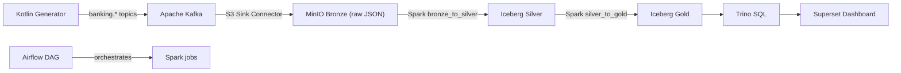
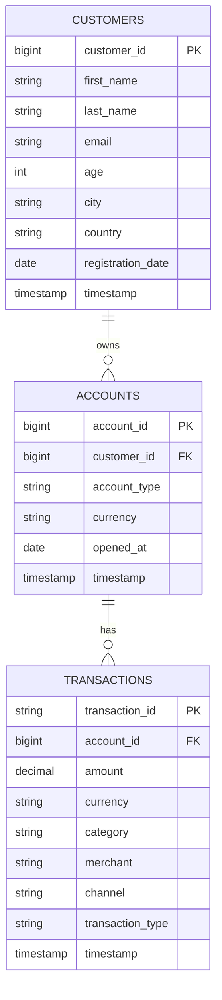
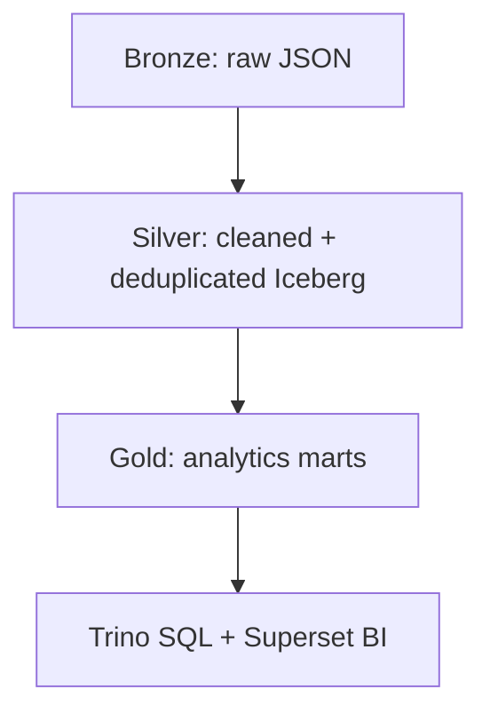
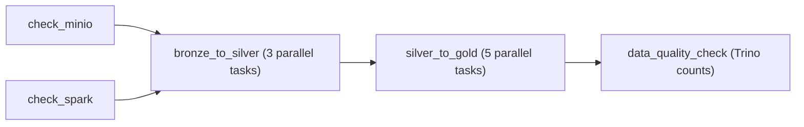

# Banking Transactions Lakehouse (Kafka + MinIO + Iceberg + Spark + Trino + Airflow + Superset)



S3 Data Lakehouse для банковского домена с Medallion-архитектурой: ingestion идёт через Kafka Connect S3 Sink в MinIO (`bronze`), Spark преобразует данные в Iceberg-таблицы (`silver`, `gold`), а Trino и Superset дают SQL/BI-слой поверх gold-витрин.

Проект сделан как production-like локальный контур: сервисы запускаются в одном `docker compose`, ключевые зависимости healthcheck-ориентированы, bootstrap-конфигурация (бакеты, Kafka Connect, Superset) автоматизирована.

---

## 🛠 Технологический стек

| Компонент | Технология | Версия | Роль |
|-----------|-----------|--------|------|
| Event producer | Kotlin + Spring Boot | 3.1.x / JDK 17 | Генерация синтетических банковских событий |
| Message bus | Apache Kafka + Zookeeper | Confluent 7.5.0 | Транспорт событий |
| Streaming ingestion | Kafka Connect S3 Sink | 10.5.7 | Запись Kafka топиков в S3-совместимое хранилище |
| Object storage | MinIO | latest | Data Lake (Bronze / Silver / Gold) |
| ETL engine | Apache Spark | 3.5 | Очистка, дедупликация, агрегации |
| Table format | Apache Iceberg | 1.5.2 | ACID-таблицы и эволюция схем |
| SQL engine | Trino | 440 | SQL-доступ к Iceberg таблицам |
| Orchestration | Apache Airflow | 2.8.1 | Оркестрация Spark pipeline |
| BI | Apache Superset | 3.1.0 | Визуализация витрин |
| Metadata DB | PostgreSQL | 15 | БД Airflow + Iceberg JDBC catalog |

---

## 🧱 Модель данных

### Bronze (raw JSON в MinIO)

- Источник: `banking.customers`, `banking.accounts`, `banking.transactions`
- Путь: `s3://lakehouse/bronze/banking.<topic>/...`
- Формат: JSON (через Kafka Connect S3 Sink)

### Silver (Iceberg)



### Gold (витрины)

- `spending_by_category` — расходы по категориям, аккаунтам и месяцам
- `customer_segments` — RFM-сегментация клиентов
- `anomaly_flags` — флаги подозрительных транзакций
- `monthly_cashflow` — кредит/дебет и net cashflow помесячно
- `channel_analysis` — объёмы и активность по каналам

---

## 🏅 Medallion Architecture



---

## 🔧 Предварительные требования

- Docker 20.10+
- Docker Compose 2.x+
- Gradle 8.13+
- JDK 17+

---

## 🚀 Быстрый старт

```bash
./gradlew :banking-lakehouse:generator:bootJar
cd banking-lakehouse
docker compose up -d --build
```

---

## 🌐 Сервисы и URL

- MinIO Console: [http://localhost:9001](http://localhost:9001) (`admin` / `admin123`)
- Kafka UI: [http://localhost:8080](http://localhost:8080)
- Spark Master UI: [http://localhost:8081](http://localhost:8081)
- Airflow: [http://localhost:8082](http://localhost:8082) (`admin` / `admin`)
- Kafka Connect REST: [http://localhost:8083](http://localhost:8083)
- Trino: [http://localhost:8085](http://localhost:8085)
- Superset: [http://localhost:8088](http://localhost:8088) (`admin` / `admin`)

---

## 🔁 Airflow DAG

`banking_lakehouse_daily` запускается `@daily` и выполняет:



Spark-job'ы запускаются через `DockerOperator` и `spark-submit` с единым набором Iceberg/S3-конфигов.

---

## 📊 Superset Dashboard

Dashboard: **Banking Analytics**

В дашборде автоматически создаются 8 чартов:
- Расходы по категориям (USD)
- Тренд расходов по месяцам
- RFM: клиенты по сегменту
- Подозрительные транзакции
- Денежный поток по месяцам
- Cashflow: топ клиентов
- Анализ каналов
- Динамика каналов

---

## ⭐ Ключевые особенности реализации

- Iceberg-таблицы в S3-совместимом хранилище (MinIO) с JDBC catalog в Postgres
- Дедупликация silver-слоя по бизнес-ключам с выбором самой свежей записи
- Data quality gate в Airflow: проверка непустых gold-витрин через Trino
- Автоматизированный bootstrap Kafka Connect и Superset при старте окружения
- Чёткое разделение ingestion (Kafka Connect), processing (Spark), serving (Trino/Superset)
