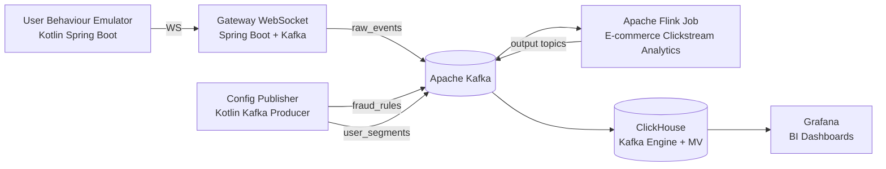
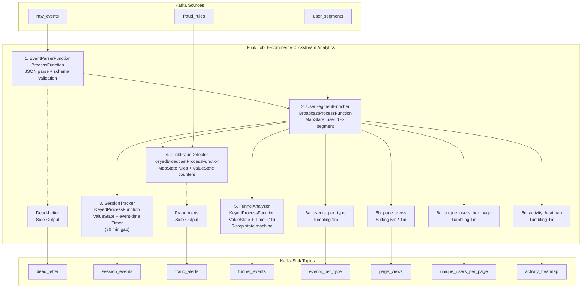
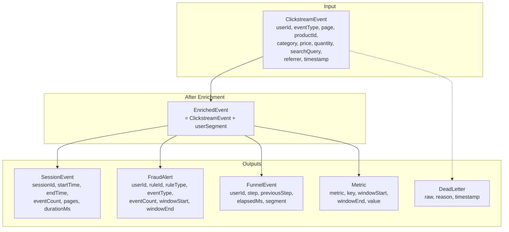
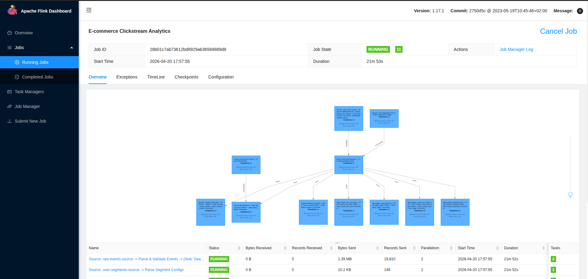
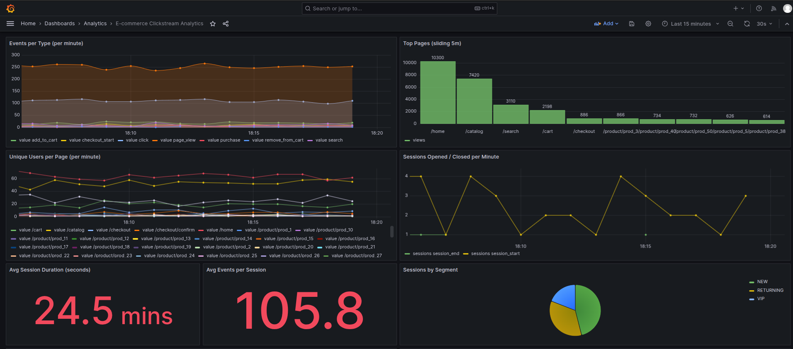
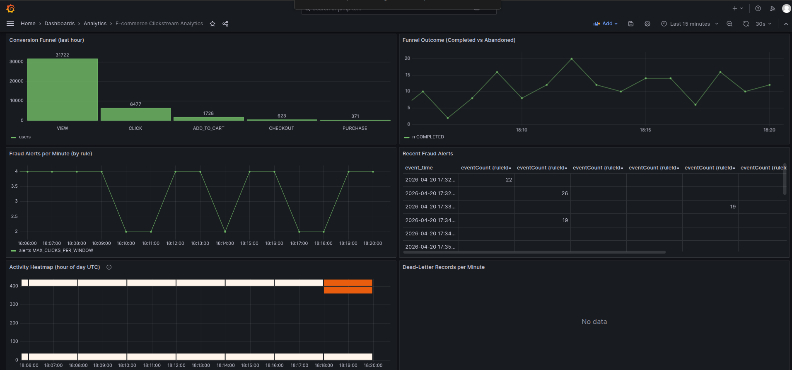

# ⚡ E-commerce Clickstream Analytics Pipeline (Apache Flink)

Стриминговый пайплайн на **Apache Flink** для real-time аналитики
e-commerce кликстрима. Акцент сделан на **stateful processing** (keyed state + event-time
timers), **broadcast state pattern** (два независимых broadcast-стрима для fraud rules и
user segments) и **side outputs** (dead letter queue + fraud alerts). Результирующий
граф операторов разворачивается в кластере Flink и визуализируется на Flink Dashboard.

---

## Схема



---

## Ключевые возможности

- ✅ **Stateful session tracking**: `KeyedProcessFunction` + `ValueState` + event-time timers, 30-минутный session gap, emit `session_start` / `session_end`
- ✅ **Click fraud detection**: `KeyedBroadcastProcessFunction` с динамическими правилами из broadcast state, side output для алертов, cooldown per rule
- ✅ **User segmentation**: второй broadcast-стрим (`user_segments`) обогащает события сегментом пользователя (NEW / RETURNING / VIP) без join'а
- ✅ **5-step conversion funnel**: `KeyedProcessFunction` со state machine (view → click → add_to_cart → checkout → purchase), emit ABANDONED / COMPLETED
- ✅ **Dead-letter side output**: невалидный JSON и схемные ошибки маршрутизируются в отдельный топик для разбора
- ✅ **Windowed aggregations**: tumbling (1m) для events-per-type, sliding (5m/1m) для page popularity, dinstinct-users через `ProcessWindowFunction`, hour-of-day heatmap
- ✅ **Checkpointing**: hashmap backend, 60s interval, externalized checkpoints, retain on cancellation
- ✅ **Exactly-once обработка внутри Flink** + at-least-once delivery в Kafka
- ✅ **ClickHouse Kafka Engine + Materialized Views**: 8 таблиц, LowCardinality + DateTime MATERIALIZED колонки
- ✅ **Grafana 10** с pre-provisioned дашбордом (13 панелей: sessions, funnel, fraud, heatmap, dead-letter, segments)

---

## Граф операторов Flink


---

## 🛠 Технологический стек

| Компонент           | Технология                                        | Роль                                                        |
| ------------------- | ------------------------------------------------- | ----------------------------------------------------------- |
| Stream processing   | **Apache Flink 1.17.1** (Kotlin, DataStream API) | Keyed / broadcast state, event-time timers, side outputs    |
| Message broker      | **Apache Kafka 7.5** (Confluent)                  | Ingress + intermediate + egress транспортные топики         |
| OLAP хранилище      | **ClickHouse 23.8**                               | Kafka Engine + MV + MergeTree, LowCardinality, DateTime MAT |
| Визуализация        | **Grafana 10.2** + ClickHouse datasource plugin   | Дашборд с 13 панелями                                       |
| Gateway             | **Spring Boot 3.1** (Kotlin, WebSocket)           | Приём событий по WS, публикация в Kafka                     |
| Event emulator      | **Spring Boot 3.1** (Kotlin)                      | State machine виртуальных пользователей + fraud-bursts      |
| Config publisher    | **Kotlin + kafka-clients**                        | Публикация fraud rules и user segments в Kafka              |
| Оркестрация         | **Docker Compose**                                | Zookeeper, Kafka, Kafka UI, Flink JM/TM, ClickHouse, Grafana |
| Kafka UI            | **Redpanda Console v3.3**                         | Инспекция топиков и сообщений                                |

---

## Архитектура обработки

### 1. `EventParserFunction` (ProcessFunction)

Читает сырой JSON из топика `raw_events`, парсит в `ClickstreamEvent` и валидирует
обязательные поля. Невалидные записи уходят в side output `INVALID_EVENTS_TAG` с кодом
причины (`parse_error` / `missing_userId` / `missing_eventType` / `missing_page` /
`invalid_timestamp`) и сохраняются в `dead_letter` топик для последующего анализа.

### 2. `UserSegmentEnricher` (BroadcastProcessFunction)

Хранит `MapState<String, String>` (userId → segment) в **broadcast state**. Каждый
парсированный event обогащается текущим сегментом пользователя (`NEW`, `RETURNING`,
`VIP`, `UNKNOWN`). Broadcast-стрим `user_segments` пишется отдельным сервисом
`config-publisher` и не требует перезапуска job'а для применения изменений.

### 3. `SessionTracker` (KeyedProcessFunction)

Key = `userId`. Держит `ValueState<SessionState>` и регистрирует **event-time timer**
на `event.timestamp + 30m`. При каждом новом событии таймер сбрасывается, сессия
удлиняется. Если watermark дошёл до таймера — эмитится `session_end` с длительностью,
количеством событий и треком посещённых страниц.

### 4. `ClickFraudDetector` (KeyedBroadcastProcessFunction)

Сочетает **keyed state** (`ValueState<MutableMap<String, Counter>>` per-user) с
**broadcast state** (правила fraud). Каждое правило описывает `(eventType, maxCount,
windowSeconds)`. Счётчик обновляется per (ruleId, eventType) в скользящем окне. При
пробое порога — emit `FraudAlert` в side output, с per-rule cooldown чтобы не спамить
алертами. Чистые события идут в main output.

### 5. `FunnelAnalyzer` (KeyedProcessFunction)

State machine: `page_view → click → add_to_cart → checkout_start → purchase`. Хранит
`ValueState<FunnelState>` + event-time timer на 1 час. Валидный переход на следующий
шаг эмитит `FunnelEvent` с `previousStep`, `elapsedMs`. Отсутствие прогресса → таймер
эмитит `ABANDONED`. Финальный `purchase` эмитит `COMPLETED` и очищает state.

### 6. Windowed aggregations

Используются две generic window-функции:
- `CountMetricWindowFunction<K>` — count событий в окне, key берётся из keyBy
  (используется для `events_per_type`, `page_views`, `activity_heatmap`).
- `UniqueUsersWindowFunction<K>` — cardinality уникальных `userId` в окне
  (используется для `unique_users_per_page`).

---

## Broadcast State Pattern

**Задача:** передать низкочастотную конфигурацию (правила, сегменты) всем параллельным
инстансам оператора без перезапуска job'а и без shuffle.

**Решение:** low-throughput Kafka-стрим → `.broadcast(MapStateDescriptor)` → `connect` с
высокочастотным event-стримом → `BroadcastProcessFunction` или
`KeyedBroadcastProcessFunction`.

В данном проекте реализованы **два независимых** broadcast-стрима:

| Broadcast поток    | Descriptor                              | Оператор                | Применение                        |
| ------------------ | --------------------------------------- | ----------------------- | --------------------------------- |
| `user_segments`    | `SEGMENT_DESCRIPTOR: String -> String`  | `UserSegmentEnricher`   | Обогащение событий сегментом      |
| `fraud_rules`      | `RULES_DESCRIPTOR: String -> FraudRule` | `ClickFraudDetector`    | Динамические пороги fraud-детекции |

`ConfigPublisher` на старте пушит полный snapshot в оба топика, а затем периодически
обновляет записи — на Grafana видно, как сегменты и пороги обновляются live.

---

## Модель данных



---

## Kafka Topics

| Топик                   | Producer             | Consumer            | Partitions | Cleanup  | Назначение                                   |
| ----------------------- | -------------------- | ------------------- | ---------- | -------- | -------------------------------------------- |
| `raw_events`            | `gateway-websocket`  | Flink job           | 3          | delete   | Сырой clickstream от эмулятора               |
| `fraud_rules`           | `config-publisher`   | Flink (broadcast)   | 1          | compact  | Динамические пороги fraud-детекции           |
| `user_segments`         | `config-publisher`   | Flink (broadcast)   | 1          | compact  | Маппинг userId → сегмент                     |
| `dead_letter`           | Flink (side output)  | ClickHouse          | 1          | delete   | Невалидные / неразобранные события           |
| `session_events`        | Flink                | ClickHouse          | 3          | delete   | `session_start` / `session_end`               |
| `fraud_alerts`          | Flink (side output)  | ClickHouse          | 1          | delete   | Алерты о fraud-паттернах                     |
| `funnel_events`         | Flink                | ClickHouse          | 3          | delete   | Шаги воронки + ABANDONED / COMPLETED         |
| `events_per_type`       | Flink                | ClickHouse          | 1          | delete   | Counts по типам событий (1m tumbling)        |
| `page_views`            | Flink                | ClickHouse          | 1          | delete   | Популярность страниц (5m sliding / 1m slide) |
| `unique_users_per_page` | Flink                | ClickHouse          | 1          | delete   | Distinct userId per page (1m tumbling)       |
| `activity_heatmap`      | Flink                | ClickHouse          | 1          | delete   | Events per hour-of-day (1m tumbling)         |

---

## 🔧 Требования

- **Docker** 20.10+
- **Docker Compose** 2.0+
- **JDK 17+** для сборки Spring Boot / Kotlin модулей
- **JDK 11+** совместим для сборки Flink-job модуля (таргет JVM 11)
- ~6 ГБ свободной памяти для локального стенда

---

## 🚀 Быстрый старт

Сборка выполняется из корня монорепозитория (`data-pipelines/`) через единый Gradle
wrapper:

```bash
cd data-pipelines

# Собрать все 4 JVM-модуля пайплайна.
./gradlew :clickstream-analytics-pipeline:flink-job:shadowJar \
          :clickstream-analytics-pipeline:config-publisher:bootJar \
          :clickstream-analytics-pipeline:gateway-websocket:bootJar \
          :clickstream-analytics-pipeline:clickstream-emulator:bootJar

# Запустить стенд.
cd clickstream-analytics-pipeline
docker-compose up -d
```

Порядок управляется через `depends_on` + `service_healthy` / `service_completed_successfully`:

1. Zookeeper → Kafka (healthcheck)
2. `kafka-init` создаёт все топики
3. `gateway-websocket` поднимается (healthcheck `/actuator/health`)
4. `config-publisher` публикует начальные правила и сегменты
5. `emulator` начинает слать события через WebSocket
6. `flink-job` сабмиттит JAR в `jobmanager`
7. `clickhouse` поднимает Kafka Engine + MV
8. `grafana` подгружает provisioned datasource + dashboard

Остановка:

```bash
docker-compose stop          # сохранить данные и контейнеры
docker-compose down          # удалить контейнеры, volumes сохраняются
docker-compose down -v       # полное удаление
```

---

## 🌐 URL сервисов

| Сервис              | URL                             | Credentials      | Описание                                    |
| ------------------- | ------------------------------- | ---------------- | ------------------------------------------- |
| **Kafka UI**        | http://localhost:8088           | —                | Инспекция топиков (Redpanda Console)        |
| **Flink Dashboard** | http://localhost:8081           | —                | Граф job'а, метрики, checkpoints            |
| **Grafana**         | http://localhost:3000           | admin / admin    | Дашборд `E-commerce Clickstream Analytics`  |
| **ClickHouse HTTP** | http://localhost:8123           | admin / admin123 | HTTP API, `play` UI                         |
| **ClickHouse TCP**  | localhost:9000                  | admin / admin123 | TCP / native client                         |
| **WebSocket GW**    | ws://localhost:8080/ws/events   | —                | Приём событий от эмулятора                  |

---

## Структура проекта

```
clickstream-analytics-pipeline/
├── README.md
├── docker-compose.yml
├── clickhouse/
│   └── clickhouse-init.sql          # Kafka Engine + MV + MergeTree для 8 выходов
├── flink-job/                        # Основной Flink job на Kotlin
│   ├── build.gradle.kts
│   └── src/main/kotlin/com/example/flink/
│       ├── ClickstreamAnalyticsJob.kt            # wiring всего графа
│       ├── model/                                # data classes (8 моделей)
│       ├── operator/                             # 5 stateful операторов
│       │   ├── EventParserFunction.kt
│       │   ├── UserSegmentEnricher.kt            # BroadcastProcessFunction
│       │   ├── SessionTracker.kt                 # KeyedProcessFunction + Timer
│       │   ├── ClickFraudDetector.kt             # KeyedBroadcastProcessFunction
│       │   └── FunnelAnalyzer.kt                 # KeyedProcessFunction + Timer
│       ├── window/                               # Generic window functions
│       │   ├── CountMetricWindowFunction.kt
│       │   └── UniqueUsersWindowFunction.kt
│       └── util/
│           ├── JsonUtils.kt
│           └── KafkaUtils.kt
├── gateway-websocket/                # Spring Boot WS → Kafka
│   ├── Dockerfile
│   ├── build.gradle.kts
│   └── src/main/kotlin/com/example/gateway/
├── clickstream-emulator/             # Генератор реалистичных сценариев
│   ├── Dockerfile
│   ├── build.gradle.kts
│   └── src/main/kotlin/com/example/client/
├── config-publisher/                 # Publisher broadcast-конфигов
│   ├── Dockerfile
│   ├── build.gradle.kts
│   └── src/main/kotlin/com/example/config/
└── grafana/
    ├── plugins/clickhouse/           # ClickHouse datasource plugin
    └── provisioning/
        ├── datasources/clickhouse.yaml
        └── dashboards/
            ├── dashboards.yaml
            └── analytics-overview.json
```

---

## Event model

Эмулятор моделирует реалистичный user journey через state machine
(`LANDED → BROWSING → CLICKED → IN_CART → AT_CHECKOUT → PURCHASED`) с drop-off
на каждом шаге. Отдельный набор "фрод"-пользователей периодически эмитит burst из
~30 кликов за 1.5 секунды для тестирования fraud detection. Пример payload:

```json
{
  "userId": "user_42",
  "eventType": "add_to_cart",
  "page": "/product/prod_15",
  "productId": "prod_15",
  "category": "electronics",
  "price": 299.99,
  "quantity": 1,
  "referrer": "/product/prod_15",
  "timestamp": 1713200000000
}
```

Поддерживаемые `eventType`: `page_view`, `click`, `add_to_cart`, `remove_from_cart`,
`checkout_start`, `purchase`, `search`.

---

## Скриншоты







---

## ✅ Что реализовано

- [x] Полный E2E поток: emulator → WS → Kafka → Flink → Kafka → ClickHouse → Grafana
- [x] `KeyedProcessFunction` с `ValueState` и event-time таймерами (SessionTracker, FunnelAnalyzer)
- [x] `BroadcastProcessFunction` для user segments
- [x] `KeyedBroadcastProcessFunction` для fraud detection
- [x] Side outputs: dead-letter + fraud alerts
- [x] Tumbling + sliding event-time windows, `ProcessWindowFunction`
- [x] `WatermarkStrategy.forBoundedOutOfOrderness` + `withIdleness`
- [x] Checkpointing с externalized checkpoints и persistent volumes
- [x] ClickHouse: 8 Kafka Engine → MV → MergeTree, LowCardinality, DateTime MATERIALIZED
- [x] Grafana dashboard с 13 панелями, provisioned datasource/dashboard
- [x] Config-publisher сервис для динамических broadcast-апдейтов
- [x] Реалистичный эмулятор с user journey state machine и fraud bursts
- [x] Читаемый граф операторов на Flink Dashboard (`uid` + `name` на каждом операторе)
