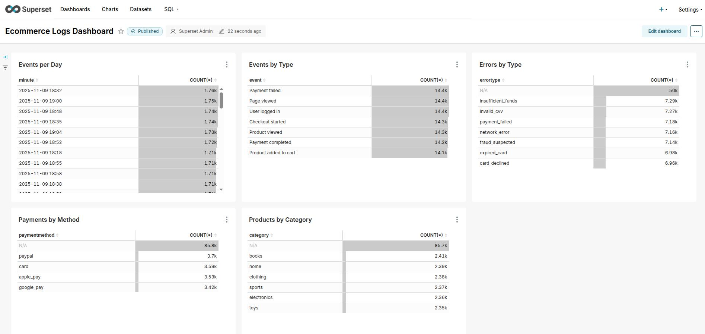

# 🛒 Ecommerce Big Data Analytics Pipeline

**Схема:**  
Log Generator → HDFS → Spark (batch processing) → PostgreSQL → Superset (BI dashboards)
+Airflow для оркестрации ETL → Livy для REST‑интеграции со Spark

Комплексный пайплайн для обработки и анализа e‑commerce логов с визуализацией метрик.

**Ключевые возможности:**
- ✅ Хранение данных в HDFS (Hadoop NameNode + DataNodes)
- ✅ Batch‑обработка логов в Apache Spark
- ✅ Оркестрация ETL‑процессов через Apache Airflow
- ✅ REST API для Spark через Apache Livy
- ✅ Хранение результатов в PostgreSQL
- ✅ BI‑дашборды и визуализация в Apache Superset

---

## 🛠 Технологический стек

### Storage & Processing
- **HDFS (Hadoop)** — распределённое файловое хранилище
- **Apache Spark** — распределённая обработка данных
- **Apache Livy** — REST API для Spark

### Orchestration
- **Apache Airflow** — DAG‑оркестрация ETL

### Database
- **PostgreSQL** — хранилище аналитических данных

### Visualization
- **Apache Superset** — BI‑дашборды и визуализация

---

## 🔧 Требования

- **Docker** 20.10+
- **Docker Compose** 2.0+
- **JDK 17+** (для сборки Spark‑приложений)
- **Gradle/Maven** (опционально, встроенный wrapper)

---

## 🚀 Быстрый старт

1. Клонируйте репозиторий и соберите Spark‑приложение:
```bash
git clone <repository-url>
cd ecommerce-pipeline
./gradlew clean build
```
2. Запустите генерацию логов:
```bash
cd data
python3 generate_logs.py
```
3. Запустите все сервисы:
```bash
cd ..
docker-compose up -d
```
4. Остановка сервисов:
```bash
# Остановка с сохранением данных
docker-compose stop

# Остановка с удалением контейнеров (данные сохраняются в volumes)
docker-compose down

# Полное удаление включая volumes (удалит все данные)
docker-compose down -v
```

## 🌐 URL сервисов

После успешного запуска, сервисы доступны по следующим адресам:

| Сервис              | URL                     | Credentials       | Описание                          |
|---------------------|-------------------------|------------------|-----------------------------------|
| **Hadoop NameNode** | http://localhost:9870   | -                | Мониторинг HDFS                   |
| **Spark Master UI** | http://localhost:8080   | -                | Мониторинг Spark cluster          |
| **Airflow Web UI**  | http://localhost:8081   | admin / admin    | Оркестрация ETL‑процессов         |
| **Superset**        | http://localhost:8088   | admin / admin    | BI‑дашборды                       |
| **PostgreSQL**      | localhost:5432          | spark / sparkpass| Хранилище аналитических данных    |
| **Livy REST API**   | http://localhost:8998   | -                | REST интерфейс для Spark          |

---

## 📊 Superset Dashboard

После запуска откройте Superset и создайте дашборд с чартами:
- **Events by Type** — распределение событий
- **Events per Minute** — активность пользователей во времени
- **Errors Over Time** — динамика ошибок
- **Errors by Type** — распределение ошибок по типам
- **Products by Category** — популярность категорий
- **Payments by Method** — статистика по методам оплаты
  
---

## 🏗️ Особенности реализации

### Data Lake & Processing
- Логи загружаются в HDFS кластер
- Spark‑кластер агрегируют события и сохраняют результаты в PostgreSQL

### Orchestration
- Airflow DAG управляет загрузкой данных и запуском Spark‑джоб
- Livy обеспечивает REST‑интеграцию для Spark

### Visualization
- Superset подключается к PostgreSQL и строит интерактивные дашборды

### Container Orchestration
- Docker для изоляции окружения сервисов
- Docker Compose для координации всех компонентов
