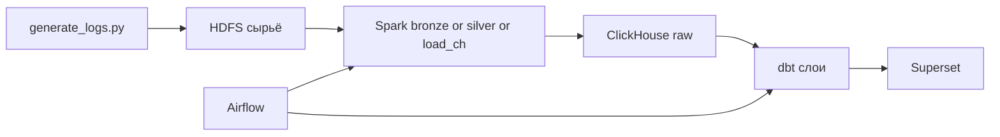
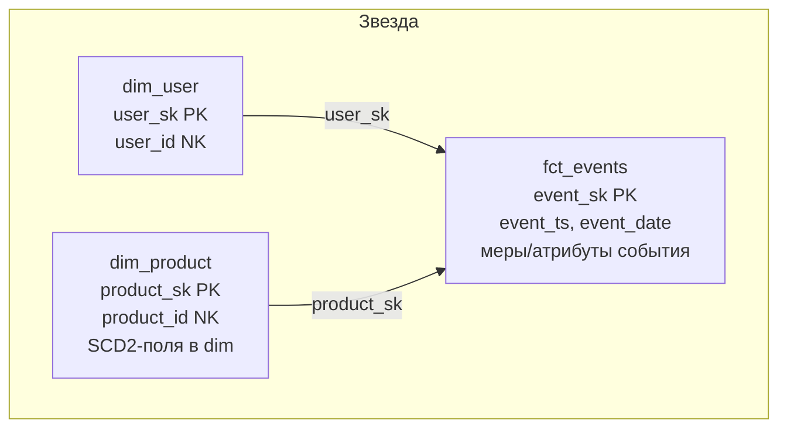
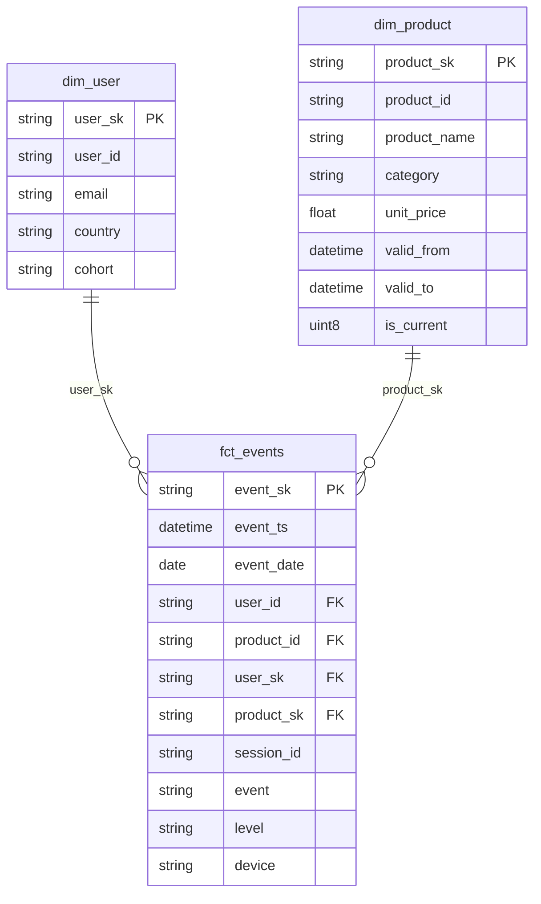
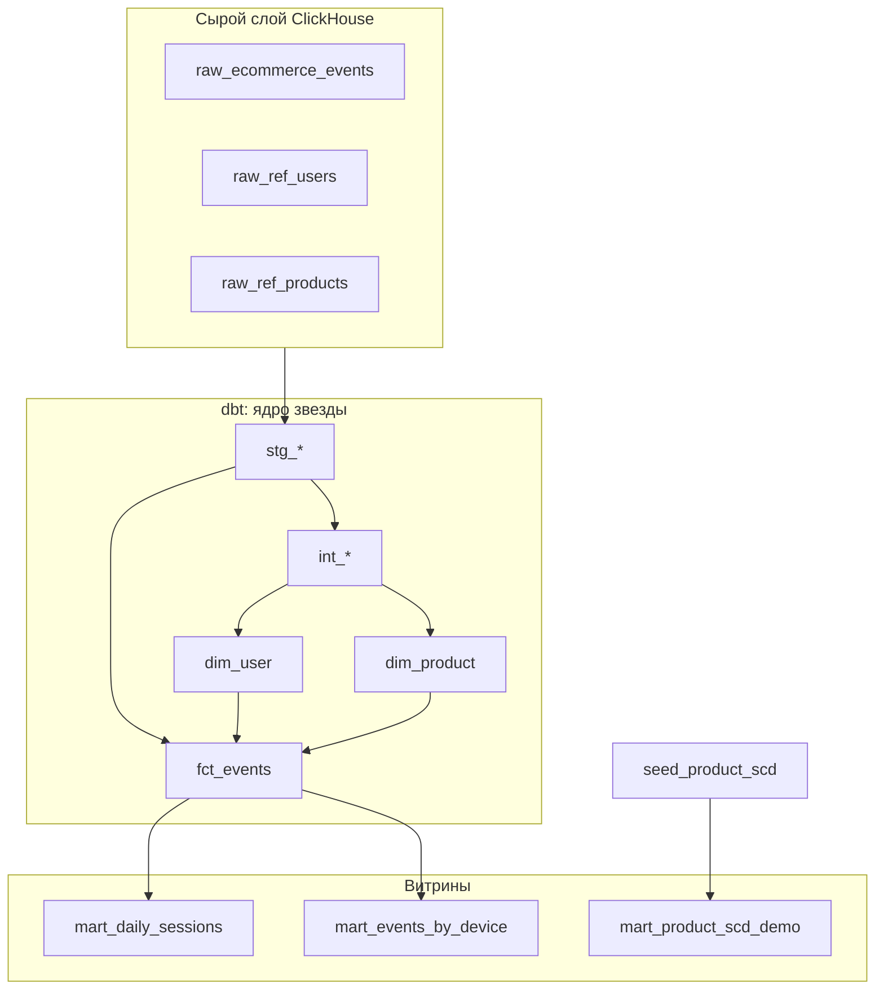

# Ecommerce batch DWH (Spark + ClickHouse + dbt + Airflow)

**Схема пайплайна:**


```mermaid
flowchart LR
  Gen[generate_logs.py] --> HDFS[HDFS сырьё]
  HDFS --> Spark[Spark bronze or silver or load_ch]
  Spark --> CH[ClickHouse raw]
  CH --> dbt[dbt слои]
  dbt --> BI[Superset]
  AF[Airflow] --> Spark
  AF --> dbt
```

Пакетная аналитика e-commerce: синтетические **события** и **справочники** (пользователи, товары) загружаются в **HDFS**, обрабатываются в **Apache Spark** (этапы `bronze` → `silver` → `load_ch`), попадают в **ClickHouse** как raw-слой, затем в **dbt** строятся измерения, факт и витрины; **Superset** подключается к ClickHouse. Оркестрация — **Apache Airflow** (проверки, три запуска Spark через **Livy**, dbt в Docker, `dbt test`).

**Ключевые возможности:**

- Хранение сырья в **HDFS**, идемпотентная загрузка в ClickHouse по **`ingest_batch_id`** (партиция, `DROP PARTITION` перед повторной вставкой батча).
- **Spark SQL / DataFrame API** (Java): очистка, дедуп, обогащение join-ами к справочникам.
- **dbt**: staging → intermediate → dimensions → facts → marts; тесты в `schema.yml`, кастомный тест на неотрицательную цену.
- **Схема звезды** в слое core: факт кликстрима + измерения пользователь и товар (см. раздел ниже).
- DAG **ecommerce_dwh_pipeline**: batch id → Spark ×3 → dbt по тегам → тесты.
- **Superset** на ClickHouse (`clickhouse-connect`).

---

## Моделирование измерений (dimensional modeling)

### Схема «звезда» (логическая)

Зерно факта — **одна строка на событие** в веб-витрине. Время задано колонками факта (`event_ts`, `event_date`), отдельного календарного измерения нет (при необходимости его можно добавить как `dim_date`).


```mermaid
flowchart TB
  subgraph star["Звезда"]
    FCT["fct_events
    event_sk PK
    event_ts, event_date
    меры/атрибуты события"]
    DU["dim_user
    user_sk PK
    user_id NK"]
    DP["dim_product
    product_sk PK
    product_id NK
    SCD2-поля в dim"]
    DU -->|user_sk| FCT
    DP -->|product_sk| FCT
  end
```

Связи:

- **`fct_events.user_sk` → `dim_user.user_sk`** (обязательная, пользователь из справочника).
- **`fct_events.product_sk` → `dim_product.product_sk`** (опционально: `NULL`, если в событии нет товара).

### ER-вид (сущности и связи)


```mermaid
erDiagram
  dim_user {
    string user_sk PK
    string user_id
    string email
    string country
    string cohort
  }
  dim_product {
    string product_sk PK
    string product_id
    string product_name
    string category
    float unit_price
    datetime valid_from
    datetime valid_to
    uint8 is_current
  }
  fct_events {
    string event_sk PK
    datetime event_ts
    date event_date
    string user_id FK
    string product_id FK
    string user_sk FK
    string product_sk FK
    string session_id
    string event
    string level
    string device
  }
  dim_user ||--o{ fct_events : "user_sk"
  dim_product ||--o{ fct_events : "product_sk"
```

### Слои данных до витрин


```mermaid
flowchart TB
  subgraph raw["Сырой слой ClickHouse"]
    R1[raw_ecommerce_events]
    R2[raw_ref_users]
    R3[raw_ref_products]
  end
  subgraph dbt_core["dbt: ядро звезды"]
    STG[stg_*]
    INT[int_*]
    DIM_U[dim_user]
    DIM_P[dim_product]
    FCT[fct_events]
    STG --> INT
    INT --> DIM_U
    INT --> DIM_P
    STG --> FCT
    DIM_U --> FCT
    DIM_P --> FCT
  end
  subgraph marts["Витрины"]
    M1[mart_daily_sessions]
    M2[mart_events_by_device]
    M3[mart_product_scd_demo]
  end
  raw --> STG
  FCT --> M1
  FCT --> M2
  seed[seed_product_scd] --> M3
```

Демо **SCD Type 2** по товарам вынесено в **`mart_product_scd_demo`** (на основе seed); основное измерение **`dim_product`** для join к факту строится из актуального среза справочника (`int_products_latest`) с суррогатным ключом и фиктивными `valid_from` / `valid_to` для единообразия модели.

---

## Технологический стек

| Компонент | Технология | Описание |
|-----------|------------|----------|
| Файловое хранилище | HDFS (Hadoop 3.2) | Bronze: `/raw/events`, `/raw/reference` |
| Обработка | Spark 3.5 (Java), `EcommerceSparkPipeline` | Этапы `bronze` / `silver` / `load_ch` |
| API Spark | Livy 0.8 | REST-запуск JAR |
| OLAP / DWH | ClickHouse 23.8 | БД `ecommerce_dwh` |
| Трансформации SQL | dbt-core, dbt-clickhouse, dbt_utils | Теги слоёв, тесты |
| Оркестрация | Airflow 2.8 | LocalExecutor, DockerOperator для dbt |
| BI | Superset | Подключение к ClickHouse |
| Метаданные Airflow | PostgreSQL | Отдельный сервис `airflow-db` |

Отдельный PostgreSQL для витрин не используется: аналитика только в ClickHouse. В compose остаётся **только** `airflow-db` — метаданные Airflow.

---

## Требования

- Docker 20.10+, Docker Compose v2
- JDK 11+ (см. `spark-app/build.gradle.kts`)
- Python 3 для `data/generate_logs.py`

Сборка fat JAR из **корня монорепозитория** `data-pipelines`:

```bash
./gradlew :ecommerce-batch-pipeline:spark-app:shadowJar
```

---

## Быстрый старт

Команды из каталога `ecommerce-batch-pipeline` (имя проекта Compose: `ecommerce-pipeline`, сеть для dbt: `ecommerce-pipeline_hadoop`):

```bash
cd data && python3 generate_logs.py && cd ..
cd .. && ./gradlew :ecommerce-batch-pipeline:spark-app:shadowJar && cd ecommerce-batch-pipeline
docker compose build
docker compose up -d
```

При первом запуске Airflow создаёт пользователя `admin` / `admin` и подключение `livy_default`. Запустите DAG **`ecommerce_dwh_pipeline`**: HDFS → Spark → ClickHouse → dbt.

Остановка: `docker compose stop`, `docker compose down`, полная очистка данных: `docker compose down -v`.

---

## URL сервисов

| Сервис | URL | Учётные данные |
|--------|-----|----------------|
| Hadoop NameNode | http://localhost:9870 | — |
| Spark Master | http://localhost:8080 | — |
| Airflow | http://localhost:8081 | admin / admin |
| ClickHouse HTTP | http://localhost:8129 | admin / admin123 |
| Superset | http://localhost:8088 | admin / admin |
| Livy | http://localhost:8998 | — |

Метаданные Airflow хранятся во внутреннем сервисе `airflow-db` (PostgreSQL), наружу не проброшен.

---

## DAG и Spark

- DAG: [`airflow/dags/ecommerce_dwh_pipeline_dag.py`](airflow/dags/ecommerce_dwh_pipeline_dag.py) — `set_batch_id` → проверки ClickHouse и Livy → `spark_bronze` → `spark_silver` → `spark_load_clickhouse` → dbt (seed, staging, …, marts) → `dbt_test`.
- Класс: `com.example.EcommerceSparkPipeline`, аргументы: `--step bronze|silver|load_ch|all`, `--batch-id <строка>`.
- HDFS: `/raw/events`, `/raw/reference`; Parquet: `/processed/bronze/<batch>/`, `/processed/silver/<batch>/`.

После правок в `dbt/` пересоберите образ: `docker compose build ecommerce-dbt`.
