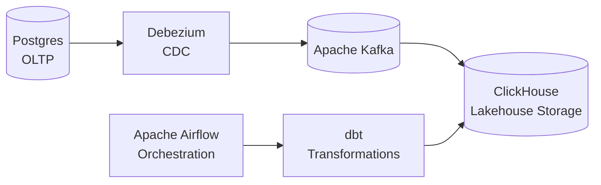
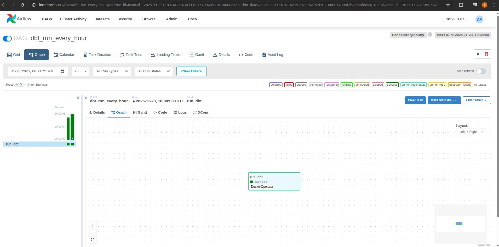

# 🏦 Fintech ELT Data Lakehouse Pipeline

**Схема:**  

Комплексный пайплайн для построения **Data Lakehouse** архитектуры в финансовой сфере с использованием **ELT‑подхода**: данные сначала загружаются в хранилище (Load), затем трансформируются внутри ClickHouse (Transform).

---

## ✨ Ключевые особенности

- ✅ **ELT‑подход**: данные из Postgres загружаются в ClickHouse без предварительных преобразований, а трансформации выполняются уже внутри Lakehouse с помощью dbt.
- ✅ **Data Lakehouse**: ClickHouse объединяет возможности Data Warehouse (SQL‑аналитика) и Data Lake (масштабируемое хранение).
- ✅ **CDC (Change Data Capture)**: Debezium отслеживает изменения в Postgres и публикует их в Kafka.
- ✅ **Streaming + Batch**: Kafka обеспечивает потоковую доставку событий, dbt и Airflow управляют пакетными трансформациями.
- ✅ **Оркестрация DAG‑ов**: Airflow контролирует запуск dbt и ELT‑процессов.
- ✅ **Мониторинг**: Kafka UI и Airflow Web UI для наблюдения за пайплайном.

---

## 🛠 Технологический стек

### Sources & CDC
- **Postgres** — транзакционная база данных
- **Debezium** — CDC‑коннектор для Kafka

### Streaming
- **Apache Kafka** — брокер сообщений
- **Kafka UI (Redpanda Console)** — мониторинг топиков

### Lakehouse Storage
- **ClickHouse** — высокопроизводительное аналитическое хранилище (Lakehouse)

### Transformation
- **dbt** — SQL‑трансформации и моделирование данных внутри ClickHouse

### Orchestration
- **Apache Airflow** — DAG‑оркестрация ELT‑процессов

---

## 🔧 Требования

- **Docker** 20.10+
- **Docker Compose** 2.0+
- **Python 3.8+** (для Airflow DAG‑ов и dbt)

---

## 🚀 Быстрый старт

1. Клонируйте репозиторий:
```bash
git clone <repository-url>
cd fintech-pipeline
```

2. Запустите все сервисы:
```bash
cd ..
docker-compose up -d
```
3. Остановка сервисов:
```bash
# Остановка с сохранением данных
docker-compose stop

# Остановка с удалением контейнеров (данные сохраняются в volumes)
docker-compose down

# Полное удаление включая volumes (удалит все данные)
docker-compose down -v
```
## 🌐 URL сервисов

| Сервис             | URL                     | Credentials       | Описание                          |
|--------------------|-------------------------|------------------|-----------------------------------|
| **Postgres**       | localhost:5432          | demo / demo      | OLTP база данных                  |
| **Debezium REST**  | http://localhost:8083   | -                | Управление CDC‑коннекторами       |
| **Kafka UI**       | http://localhost:8088   | -                | Мониторинг Kafka топиков          |
| **ClickHouse HTTP**| http://localhost:8123   | admin / admin123 | Lakehouse хранилище               |
| **Airflow Web UI** | http://localhost:8081   | admin / admin    | Оркестрация ELT‑процессов         |

---

## 🏗️ Особенности реализации

### ELT‑подход
- **Extract**: Debezium извлекает изменения из Postgres
- **Load**: Kafka доставляет события в ClickHouse
- **Transform**: dbt выполняет SQL‑трансформации прямо внутри ClickHouse

### Data Lakehouse
- ClickHouse хранит сырые и преобразованные данные в едином хранилище
- Поддержка как потоковой загрузки, так и пакетной аналитики
- Гибкость для построения моделей данных и BI‑дашбордов

### Orchestration
- Airflow DAG управляет запуском dbt и контролирует ELT‑процессы
- Возможность расширения пайплайна новыми задачами

---

## 📊 Пример аналитики

Подключив BI‑инструмент (например, Superset или Grafana) к ClickHouse, можно построить дашборды:
- **Transactions per Minute** — активность пользователей во времени
- **Top Accounts by Volume** — лидеры по транзакциям
- **Payments by Method** — статистика по методам оплаты
- **Errors Over Time** — динамика ошибок CDC

DAG:
  
---
