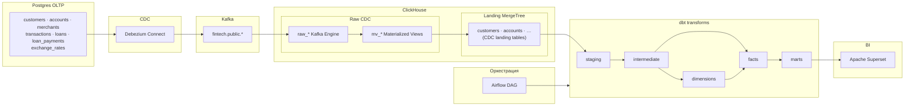
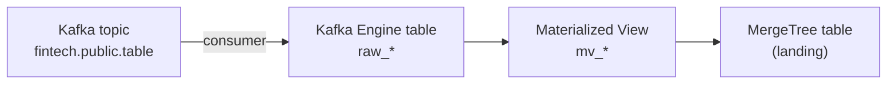
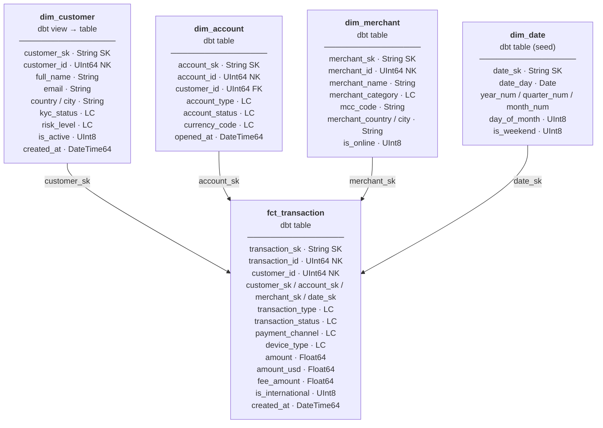
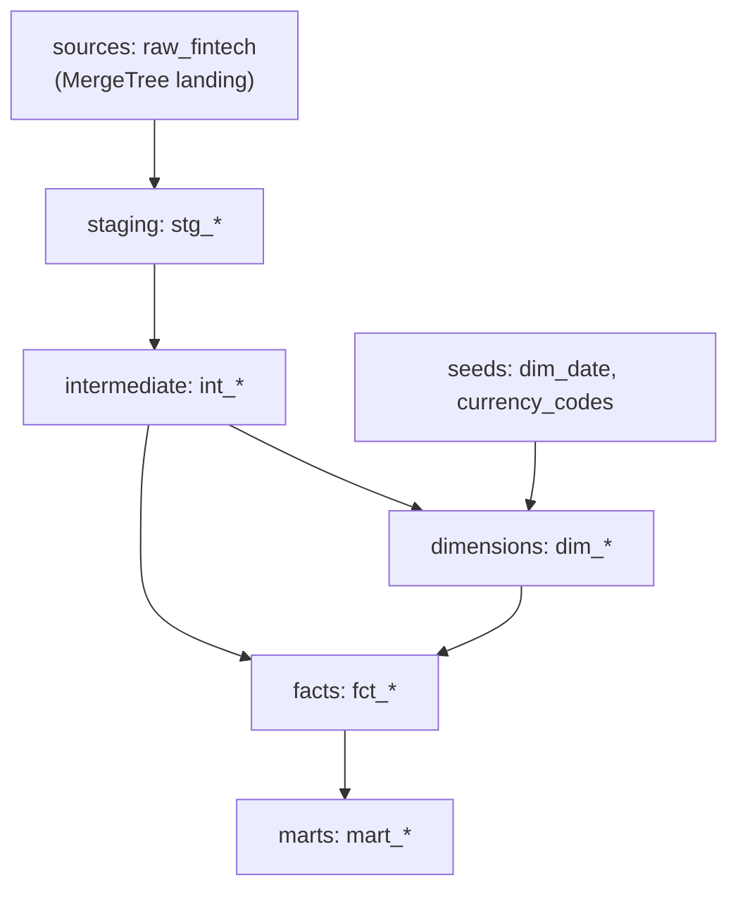
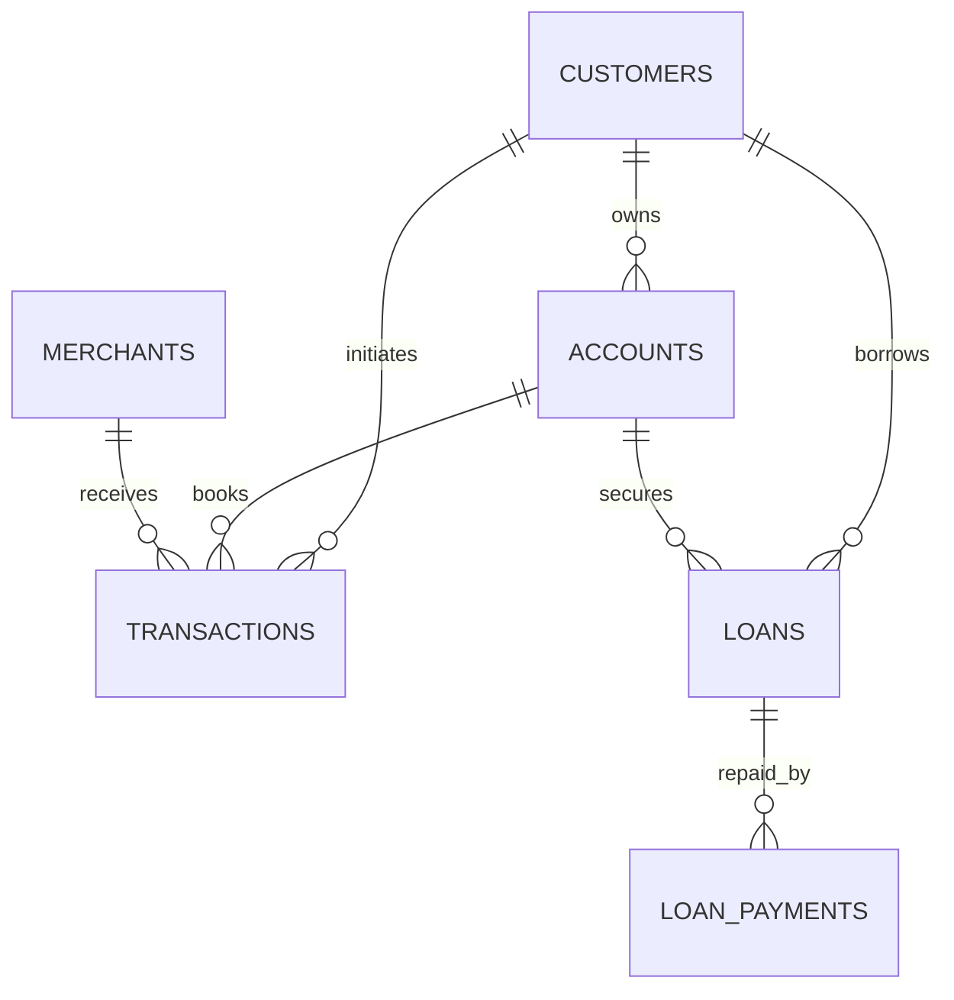

# Fintech Lakehouse Analytics

Production-like data engineering пайплайн для финтех-аналитики:
`Postgres -> Debezium -> Kafka -> ClickHouse -> dbt -> Airflow -> Superset`.

## Архитектура




После старта коннектора тестовые данные загружаются сервисом `data-loader` в Postgres — вставки идут в WAL и попадают в тот же CDC → Kafka → ClickHouse.

**Паттерн загрузки из Kafka в ClickHouse:**



## Star Schema

Основная звезда строится вокруг **`fct_transaction`**: одна строка — одна операция, ключевые измерения — клиент, счёт, мерчант, дата. Измерения в dbt — **Type 1** (текущий срез по natural key), с surrogate key (`*_sk`).



*SK = surrogate key (dbt `generate_surrogate_key`), NK = natural key из источника, LC = низкая кардинальность (аналог `LowCardinality` в сыром ClickHouse).*

`dim_currency` строится из seed `currency_codes` и используется для справочника валют; в `fct_transaction` валюта операции задаётся мерами (`amount`, `amount_usd`), при необходимости джойн к `dim_currency` идёт по `stg_accounts.currency_code` или отдельной логике во витринах.

Дополнительные fact-таблицы (**не полная звезда в текущей модели**):
- **`fct_daily_balance`** — grain «день × счёт × клиент», снимок баланса из `stg_accounts`.
- **`fct_loan`** — grain «кредит», атрибуты и агрегаты платежей; связь с клиентом/счётом по natural key (`customer_id`, `account_id`).

## Слои dbt (lineage)



## ER: источник в Postgres

Упрощённая связность OLTP перед CDC:



Таблица `exchange_rates` — справочник курсов по дате и паре валют, без FK к остальным таблицам (используется при генерации транзакций и в аналитике).

## Решение задачи

Финтех-команде нужна единая аналитическая платформа, которая:
- получает изменения из транзакционной БД почти в реальном времени;
- хранит и сырые события, и аналитические модели в одном хранилище;
- считает метрики для продукта, риска, платежей и кредитного портфеля;
- позволяет быстро строить дашборды и проверять гипотезы.

Основная проблема, которую решает проект: убрать разрыв между OLTP-данными и аналитикой, чтобы метрики были актуальными, воспроизводимыми и прозрачными по lineage.

## Слои данных в ClickHouse + dbt

Как устроено решение:
- `raw_*` таблицы Kafka Engine + materialized views принимают CDC-события из Debezium;
- `staging`: очистка и стандартизация исходных сущностей (`customers`, `accounts`, `transactions`, `loans` и др.);
- `intermediate`: переиспользуемая бизнес-логика и обогащения;
- `dimensions`: измерения для star schema (`dim_customer`, `dim_account`, `dim_merchant`, `dim_date`, `dim_currency`);
- `facts`: факт-слои (`fct_transaction`, `fct_daily_balance`, `fct_loan`);
- `marts`: готовые витрины для бизнес-метрик:
  - `mart_daily_revenue`
  - `mart_customer_lifetime_value`
  - `mart_customer_rfm_segmentation`
  - `mart_monthly_cohort_retention`
  - `mart_payment_channel_mix`
  - `mart_loan_portfolio_health`
  - `mart_merchant_category_spend`
  - `mart_fraud_risk_indicators`

Важно: наполнение тестовыми данными выполняется отдельным сервисом `data-loader` после старта `debezium`/`kafka`, чтобы вставки проходили через CDC-поток в Kafka.

## Оркестрация (Airflow)

Airflow DAG `fintech_dbt_layered_hourly` решает задачу управляемого и повторяемого запуска трансформаций:

1. `check_clickhouse`
2. `check_data_freshness`
3. `prepare` (`dbt deps -> dbt seed`)
4. `transform` (`staging -> intermediate -> dimensions -> facts -> marts`)
5. `dbt_test`

## Визуализация (Apache Superset)

Паттерн как в `marketing-analytics-platform`: контейнер поднимает Superset, затем скрипт подключается к API, создаёт подключение к ClickHouse, датасеты на витринах и дашборд **«Fintech Analytics»** с чартами.

| № | Название чарта | Тип | Источник (витрина) | Что показывает |
|---|----------------|-----|-------------------|----------------|
| 1 | Дневная выручка (USD) | Line (ECharts time series) | `mart_daily_revenue` | Динамика `daily_revenue_usd` по полю `day` |
| 2 | RFM: клиенты по сегменту | Bar (dist_bar) | `mart_customer_rfm_segmentation` | Число клиентов (`count(customer_sk)`) по `segment` (VIP / LOYAL / REGULAR) |
| 3 | Объём по каналу платежа (USD) | Bar (dist_bar) | `mart_payment_channel_mix` | Сумма `amount_usd` по `payment_channel` |
| 4 | Кредитный портфель по статусу | Table | `mart_loan_portfolio_health` | `loan_status`, остатки и «рисковый» outstanding |
| 5 | Траты по категории мерчанта (USD) | Bar (dist_bar) | `mart_merchant_category_spend` | `total_spend_usd` по `merchant_category` |
| 6 | Когорты: активные клиенты | Table | `mart_monthly_cohort_retention` | `cohort_month`, `active_month`, `cohort_age_month`, `active_customers` |
| 7 | Индикаторы риска | Table | `mart_fraud_risk_indicators` | Клиент/день, объём транзакций, international, failed |
| 8 | Топ клиентов по CLV (USD) | Table | `mart_customer_lifetime_value` | `lifetime_value_usd`, `transaction_count` по `customer_id` |

Подключение к БД в Superset: **ClickHouse Fintech** → `clickhousedb://admin@…/default`.

## Быстрый старт

Из директории проекта:

```bash
docker-compose up -d --build
```

Ручной запуск dbt (опционально):

```bash
docker compose run --rm dbt deps
docker compose run --rm dbt seed
docker compose run --rm dbt run
docker compose run --rm dbt test
```

Остановка сервисов:

```bash
docker-compose down
```

## Адреса сервисов

| Сервис | URL | Учетные данные |
|---|---|---|
| Postgres | `localhost:5432` | `demo/demo` |
| Debezium | `http://localhost:8083` | - |
| Kafka UI | `http://localhost:8088` | - |
| ClickHouse HTTP | `http://localhost:8123` | `admin/admin123` |
| Airflow | `http://localhost:8081` | `admin/admin` |
| Superset | `http://localhost:8089` | `admin/admin` |

## Что получает бизнес на выходе

- Актуальные метрики по выручке, каналам платежей, сегментам клиентов и кредитному портфелю
- Прозрачный путь данных от события в Postgres до графика в Superset
- Стабильные регламентные обновления витрин через Airflow
- Единый SQL-контур аналитики в ClickHouse без ручных выгрузок
- Основа для дальнейшего развития: алерты, SLA, data quality и новые витрины
