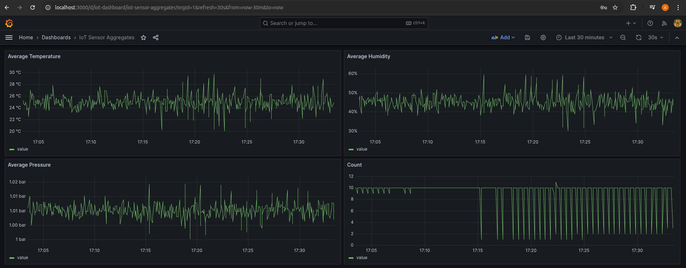

# IoT Real-Time Analytics Pipeline

**Схема:** Iot data generator (Kotlin Spring Boot app) -> PostgreSQL -> Debezium -> Apache Kafka -> Kafka Streams (Kotlin Spring Boot app) 
-> Apache Kafka ->
ClickHouse -> Grafana

Комплексный пайплайн для real-time обработки IoT данных с визуализацией метрик.

**Ключевые возможности:**
- ✅ CDC с PostgreSQL через Debezium
- ✅ Stream processing на Kafka Streams
- ✅ Columnar storage в ClickHouse для аналитики
- ✅ Real-time визуализация в Grafana
- ✅ Автоматическая агрегация по временным окнам
---

## 🛠 Технологический стек

### Streaming
- **Apache Kafka** - распределенный streaming platform
- **Kafka Streams** - stream processing framework

### Storage
- **PostgreSQL** - OLTP база данных
- **ClickHouse** - columnar OLAP storage

### CDC & Integration
- **Debezium** - CDC platform
- **Kafka Connect** - integration framework

### Visualization & Monitoring
- **Grafana** - метрики и визуализация

### Languages & Frameworks
- **Kotlin** / **Java** - JVM-based приложения
- **Spring Boot** - application framework

## 🔧 Требования

- **Docker** 20.10+
- **Docker Compose** 2.0+
- **JDK 17+** (для сборки приложений)
- **Gradle** (опционально, встроенный wrapper)

## 🚀 Быстрый старт

1. Клонируйте репозиторий и соберите проект:
```bash
git clone <repository-url>
cd data-pipelines
./gradlew clean build
```

2. Перейдите в интересующий пайплайн:
```bash
cd iot-pipeline
```

3. Запустите:
```bash
docker-compose up -d
```
Остановка сервисов

```bash
# Остановка с сохранением данных
docker-compose stop

# Остановка с удалением контейнеров (данные сохраняются в volumes)
docker-compose down

# Полное удаление включая volumes (⚠️ удалит все данные)
docker-compose down -v
```

## 🌐 URL сервисов

После успешного запуска, сервисы доступны по следующим адресам:

| Сервис | URL | Credentials | Описание |
|--------|-----|-------------|----------|
| **Grafana** | http://localhost:3000 | admin / admin | Веб-интерфейс для визуализации метрик IoT сенсоров |
| **Kafka UI** | http://localhost:8080 | - | Мониторинг Kafka топиков и сообщений |
| **ClickHouse HTTP** | http://localhost:8123 | admin / admin123 | HTTP интерфейс ClickHouse |
| **Debezium Connect** | http://localhost:8083 | - | REST API для управления connectors |
| **PostgreSQL** | localhost:5432 | admin / admin123 | Прямое подключение к БД |
| **Kafka Broker** | localhost:9092 | - | Kafka broker для producer/consumer |
| **Zookeeper** | localhost:2181 | - | Zookeeper для Kafka |

### Grafana Dashboard

После запуска откройте Dashboards → IoT Sensor Aggregates.

Дашборд включает:
- **Average Temperature** - график средней температуры во времени
- **Average Humidity** - график средней влажности во времени
- **Average Pressure** - график среднего давления во времени



---

## 🏗️ Особенности реализации

### Event-Driven Architecture
- Асинхронная обработка через события Kafka
- Разделение ответственности между сервисами
- Возможность масштабирования компонентов независимо

### Stream Processing
- Sliding time windows (10 секунд)
- Stateful агрегация по deviceId
- Fault-tolerant processing через Kafka Streams

### CDC Pattern
- WAL-based захват изменений (low latency)
- Автоматическое отслеживание schema changes

### Columnar Storage
- ClickHouse Optimized для аналитических запросов
- Materialized View для автоматической ETL
- Компрессия данных

### Container Orchestration
- Docker для изоляции окружения сервисов
- Docker Compose для координации сервисов
