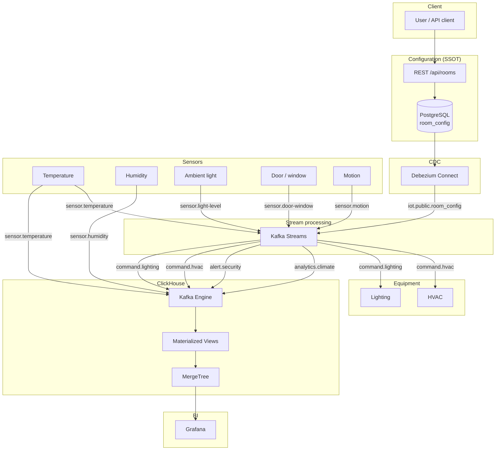
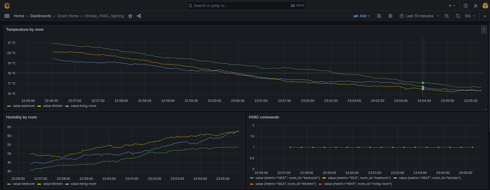
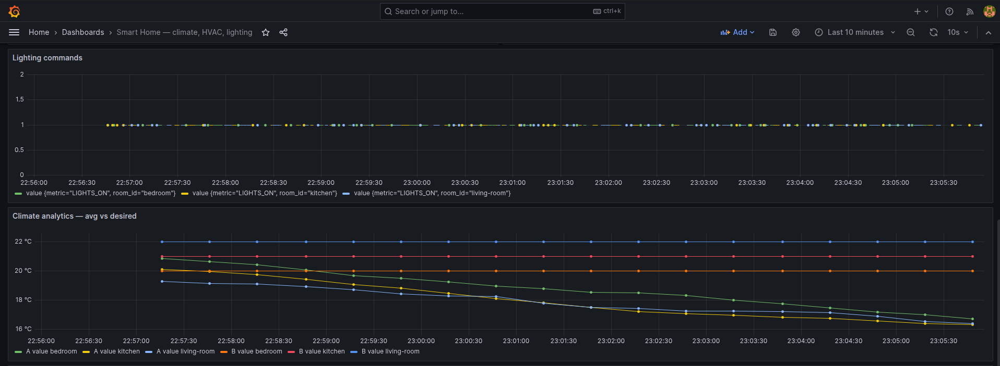

# Smart Home IoT Pipeline

Демо-пайплайн **потоковой аналитики для умного дома**: `PostgreSQL (конфиг) → Debezium → Kafka → Kafka Streams → Kafka (команды / аналитика / алерты)` с **петлей симуляции** (команды меняют физику комнаты и новые показания снова в Kafka) и витриной **`Kafka → ClickHouse → Grafana`** для операционных дашбордов.

**Схема:**


```mermaid
flowchart TB
  subgraph client ["Client"]
    U["User / API client"]
  end

  subgraph config ["Configuration (SSOT)"]
    REST["REST /api/rooms"]
    RC[("PostgreSQL<br/>room_config")]
  end

  subgraph cdc ["CDC"]
    DEB["Debezium Connect"]
  end

  subgraph sensors ["Sensors"]
    T["Temperature"]
    HUM["Humidity"]
    LUX["Ambient light"]
    DW["Door / window"]
    MOT["Motion"]
  end

  subgraph processing ["Stream processing"]
    TOP["Kafka Streams"]
  end

  subgraph equipment ["Equipment"]
    HVAC["HVAC"]
    LTS["Lighting"]
  end

  subgraph olap ["ClickHouse"]
    KE["Kafka Engine"]
    MV["Materialized Views"]
    MT["MergeTree"]
  end

  subgraph bi ["BI"]
    GF["Grafana"]
  end

  U --> REST --> RC --> DEB
  DEB -->|iot.public.room_config| TOP

  T -->|sensor.temperature| TOP
  HUM -->|sensor.humidity| KE
  LUX -->|sensor.light-level| TOP
  DW -->|sensor.door-window| TOP
  MOT -->|sensor.motion| TOP

  TOP -->|command.hvac| HVAC
  TOP -->|command.lighting| LTS
  TOP -->|analytics.climate| KE
  TOP -->|alert.security| KE

  T -->|sensor.temperature| KE
  TOP -->|command.hvac| KE
  TOP -->|command.lighting| KE
  KE --> MV --> MT --> GF
```

End-to-end контур **умного дома**: симулятор публикует датчики в Kafka, **Kafka Streams** рассчитывает климат, освещение и охрану на фоне **KTable** из CDC; команды уходят в «оборудование» внутри симулятора (замкнутая петля физики). Конфигурация комнат — **PostgreSQL** → **Debezium** → `iot.public.room_config`. Для наблюдаемости выбранные топики принимаются в **ClickHouse** (Kafka Engine + MV) и визуализируются в **Grafana**.

**Ключевые возможности:**
- ✅ Замкнутый контур: стримы → команды → физика комнаты → новые показания датчиков
- ✅ CDC `room_config` без опроса БД из стримов; join KStream × KTable
- ✅ Климат: tumbling 30 с + suppress, HVAC, ветка `analytics.climate`
- ✅ Освещение: motion × lux × конфиг → `command.lighting`
- ✅ Охрана: дверь/окно и движение → merge в `alert.security`
- ✅ ClickHouse: Kafka Engine + MergeTree + MV для температуры, влажности, HVAC, **освещения**, аналитики климата, тревог
- ✅ REST: симулятор `/api/rooms`, стримы IQ `/api/state/...`
- ✅ Docker Compose: топики, коннектор, ожидание CDC-топика, healthchecks

---

## 🛠 Технологический стек

| Компонент | Технология | Описание |
|-----------|-----------|----------|
| **Язык / runtime** | Kotlin 1.9 + Spring Boot 3.1 | Симулятор и Kafka Streams |
| **Брокер сообщений** | Apache Kafka (Confluent 7.5) | Датчики, команды, CDC |
| **OLTP конфигурации** | PostgreSQL 15 | `wal_level=logical`, `room_config` |
| **CDC** | Debezium 2.5 | Топик `iot.public.room_config` |
| **Stream processing** | Apache Kafka Streams | Окна, join, state store для IQ |
| **OLAP** | ClickHouse 23.8 | Kafka Engine → MergeTree |
| **BI** | Grafana 10.2 | Провиженинг datasource и дашборда |
| **Инфраструктура** | Docker Compose | Сервисы в `iot-pipeline/`; build context — корень монорепо |

---

## 🔧 Требования

- **Docker** 20.10+
- **Docker Compose** 2.0+
- **JDK 17+** (локальная сборка `bootJar` для образов JVM)

---

## 🚀 Быстрый старт

1. Соберите JAR из корня монорепозитория `data-pipelines/` (образы **не** запускают Gradle внутри Docker):

```bash
./gradlew :iot-pipeline:smart-home-simulator:bootJar :iot-pipeline:kafka-streams-app:bootJar
```

2. Запустите стек (контекст Docker — корень репо):

```bash
cd iot-pipeline
docker compose up -d --build
```

**Что происходит по шагам:**
1. Zookeeper и Kafka; прикладные топики (`scripts/kafka-init-topics.sh`).
2. Postgres (`postgres/init.sql`) и регистрация коннектора (`init-debezium.sh`).
3. Ожидание топика `iot.public.room_config` (`scripts/wait-for-debezium-topic.sh`).
4. ClickHouse (`clickhouse-init.sql`), **smart-home-simulator**, **kafka-streams-app**, Grafana.

**Остановка:**

```bash
docker compose down -v
```

---

## 🌐 URL сервисов

После `docker compose up -d --build` интерфейсы доступны локально:

| Сервис | URL | Credentials | Описание |
|--------|-----|-------------|----------|
| **Grafana** | http://localhost:3000 | admin / admin | Дашборд «Smart Home — climate, HVAC, lighting» |
| **ClickHouse HTTP** | http://localhost:8123 | admin / admin123 | HTTP |
| **ClickHouse TCP** | localhost:9000 | admin / admin123 | Нативный клиент |
| **Kafka UI** | http://localhost:8080 | — | Топики и сообщения |
| **Debezium** | http://localhost:8083 | — | REST Connect |
| **Симулятор** | http://localhost:8085 | — | `GET` / `PATCH /api/rooms` |
| **Kafka Streams (IQ)** | http://localhost:8086 | — | `GET /api/state/rooms/...` |

---

## 📁 Структура проекта

```
iot-pipeline/
├── docker-compose.yml
├── README.md
├── docs/
│   ├── grafana_1.png              # Скриншот Grafana (климат, влажность, HVAC)
│   └── grafana_2.png              # Скриншот Grafana (освещение, аналитика, охрана)
├── postgres/
│   └── init.sql                   # room_config + seed
├── scripts/
│   ├── kafka-init-topics.sh
│   └── wait-for-debezium-topic.sh
├── init-debezium.sh
├── clickhouse-init.sql             # Kafka Engine + MergeTree + MV
├── smart-home-simulator/
│   ├── Dockerfile
│   ├── build.gradle.kts
│   └── src/main/kotlin/com/smarthome/simulator/
│       ├── SmartHomeSimulatorApplication.kt
│       ├── physics/
│       ├── sensor/
│       ├── actuator/               # command.hvac, command.lighting
│       ├── api/
│       ├── entity/ · repo/
│       ├── config/
│       └── model/
├── kafka-streams-app/
│   ├── Dockerfile
│   ├── build.gradle.kts
│   └── src/main/kotlin/com/example/streams/
│       ├── KafkaStreamsApplication.kt
│       ├── topology/SmartHomeTopology.kt
│       ├── stream/KafkaStreamsConfig.kt
│       ├── cdc/RoomConfigCdcParser.kt
│       ├── model/Domain.kt
│       ├── enums/WireEnums.kt
│       ├── serde/JacksonSerde.kt
│       └── api/StateQueryController.kt
└── grafana/provisioning/
    ├── datasources/clickhouse.yaml
    └── dashboards/
        ├── dashboard.yaml
        └── smart-home.json
```

Gradle-модули в корне: `:iot-pipeline:smart-home-simulator`, `:iot-pipeline:kafka-streams-app`.

---

## 🔄 Kafka → ClickHouse (ingestion)

Паттерн как в других проектах репозитория:

```
Kafka Topic ──► Kafka Engine Table ──► Materialized View ──► MergeTree
```

Таблицы `*_kafka` — виртуальные consumers; MV читают батчи, парсят **JSONEachRow** (`roomId`, `ts`, …), нормализуют время и пишут в **MergeTree** для Grafana. В демо **не** дублируется полный Debezium Envelope в OLAP — только прикладные топики.

| MergeTree-таблица | Источник (топик) | Назначение |
|-------------------|------------------|------------|
| `sensor_temperature` | `sensor.temperature` | Температура по комнатам |
| `sensor_humidity` | `sensor.humidity` | Влажность |
| `commands_hvac` | `command.hvac` | Команды HVAC |
| `commands_lighting` | `command.lighting` | Команды освещения |
| `analytics_climate` | `analytics.climate` | Средняя t° и setpoint |
| `alerts_security` | `alert.security` | Тревоги охраны |

---

## ⚙️ Kafka Streams (топологии)

| Блок | Логика |
|------|--------|
| **Climate** | Окно 30 с + suppress → средняя температура; join с KTable конфигурации; `HEAT` / `COOL` / `IDLE` → `command.hvac`; срез → `analytics.climate` |
| **Lighting** | Motion × последний lux (KTable) × конфиг → `LIGHTS_ON`; lux выше порога → `LIGHTS_OFF` → `command.lighting` |
| **Security** | Дверь/окно и движение + конфиг; при `armed` → merge → `alert.security` |
| **IQ** | `toTable` → store `last-hvac-store` → REST |

Семантика: **at least once**. Ключ в Kafka — `roomId` комнаты; в JSON поле **`roomId`** (camelCase).

**Образ JVM:** базовый слой `eclipse-temurin:17-jre-alpine` дополнен пакетом `libstdc++` (нативный RocksDB в state store).

---

## 🎯 Симулятор и REST

- **Физика:** пересчёт температуры, влажности, условной освещённости; реакция на HVAC и свет.
- **Конфиг:** `PATCH /api/rooms/{roomId}` обновляет Postgres → CDC → обновление KTable в стримах.

Примеры:

```bash
curl -s http://localhost:8085/api/rooms | jq .

curl -s -X PATCH http://localhost:8085/api/rooms/living-room \
  -H "Content-Type: application/json" \
  -d '{"desired_temperature": 23.0, "security_mode": "armed"}' | jq .
```

Допустимые значения: `hvac_mode` — `auto` | `heat` | `cool` | `off`; `security_mode` — `armed` | `disarmed` | `night`; `lighting_mode` — `auto` | `manual` | `off`.

IQ (последнее решение регулятора HVAC):

```bash
curl -s http://localhost:8086/api/state/rooms/living-room/hvac | jq .
curl -s http://localhost:8086/api/state/rooms | jq .
```

---

## 📊 Grafana Dashboard

При старте Grafana подхватывает файловый провиженинг (`grafana/provisioning/`): datasource **ClickHouse** и дашборд **«Smart Home — climate, HVAC, lighting»** (uid `smart-home-main`, datasource uid `clickhouse-iot`). Запросы — **raw SQL** к MergeTree-таблицам.

| № | Панель | Тип | Таблица (ClickHouse) | Что показывает |
|---|--------|-----|----------------------|----------------|
| 1 | Temperature by room | Time series | `sensor_temperature` | Температура по комнатам |
| 2 | Humidity by room | Time series | `sensor_humidity` | Влажность |
| 3 | HVAC commands | Time series | `commands_hvac` | События `HEAT` / `COOL` / `IDLE` |
| 4 | Lighting commands | Time series | `commands_lighting` | `LIGHTS_ON` / `LIGHTS_OFF` |
| 5 | Climate analytics — avg vs desired | Time series | `analytics_climate` | Средняя t° и целевая |
| 6 | Security alerts | Table | `alerts_security` | Последние тревоги охраны |

Скриншоты дашборда (лежат в `iot-pipeline/docs/`):






---

## 📨 Основные топики Kafka

| Топик | Назначение |
|-------|------------|
| `sensor.temperature`, `sensor.humidity`, `sensor.motion`, `sensor.light-level`, `sensor.door-window` | Показания симулятора |
| `iot.public.room_config` | CDC конфигурации |
| `command.hvac`, `command.lighting` | Команды «актуаторам» |
| `analytics.climate` | Сниппет для BI |
| `alert.security` | Тревоги |

Топик `alert.device-health` создаётся скриптом инициализации; продюсер в демо не подключён.

---

## ✅ Чеклист

- [x] CDC Postgres → Debezium → Kafka Streams KTable
- [x] Топологии климат / освещение / охрана
- [x] ClickHouse ingestion для наблюдаемых топиков (включая освещение)
- [x] Grafana: провиженинг дашборда и datasource
- [x] Docker Compose с healthchecks и гейтами по топикам
- [x] JVM-образы из предсобранных JAR; зависимости RocksDB в Alpine
