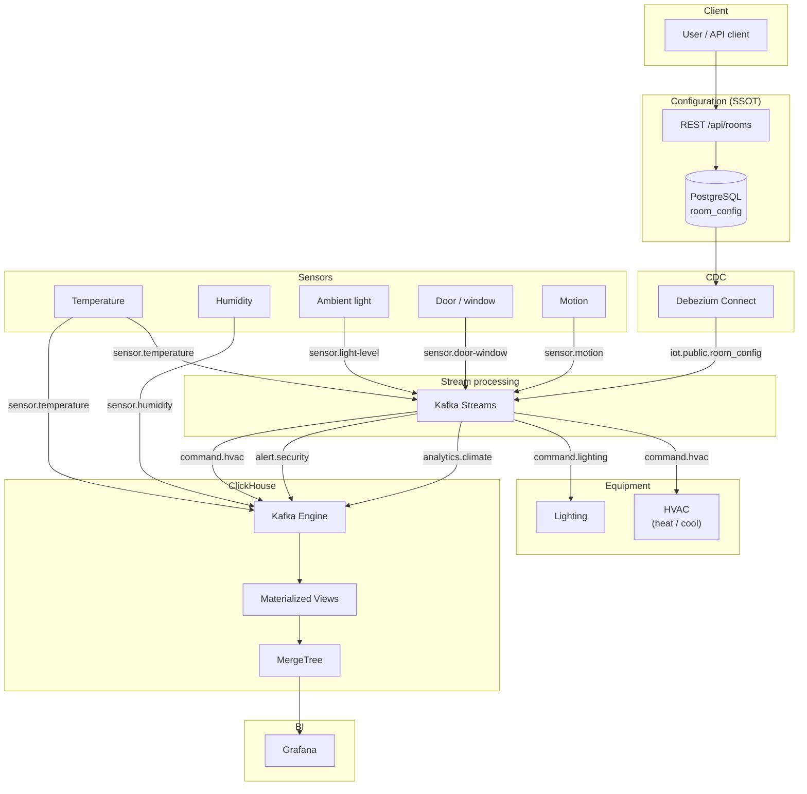

# Smart Home IoT Pipeline

**Схема:**


```mermaid
flowchart TB
  subgraph client ["Client"]
    U["User / API client"]
  end

  subgraph config ["Configuration (SSOT)"]
    REST["REST /api/rooms"]
    RC[("PostgreSQL<br/>room_config")]
  end

  subgraph cdc ["CDC"]
    DEB["Debezium Connect"]
  end

  subgraph sensors ["Sensors"]
    T["Temperature"]
    HUM["Humidity"]
    LUX["Ambient light"]
    DW["Door / window"]
    MOT["Motion"]
  end

  subgraph processing ["Stream processing"]
    TOP["Kafka Streams"]
  end

  subgraph equipment ["Equipment"]
    HVAC["HVAC<br/>(heat / cool)"]
    LTS["Lighting"]
  end

  subgraph olap ["ClickHouse"]
    KE["Kafka Engine"]
    MV["Materialized Views"]
    MT["MergeTree"]
  end

  subgraph bi ["BI"]
    GF["Grafana"]
  end

  U --> REST --> RC --> DEB
  DEB -->|iot.public.room_config| TOP

  T -->|sensor.temperature| TOP
  HUM -->|sensor.humidity| KE
  LUX -->|sensor.light-level| TOP
  DW -->|sensor.door-window| TOP
  MOT -->|sensor.motion| TOP

  TOP -->|command.hvac| HVAC
  TOP -->|command.lighting| LTS
  TOP -->|analytics.climate| KE
  TOP -->|alert.security| KE

  T -->|sensor.temperature| KE
  TOP -->|command.hvac| KE
  KE --> MV --> MT --> GF
```

Потоковый контур **умного дома**: датчики (симулятор) публикуют в Kafka, **Kafka Streams** решает климат, освещение и охрану, команды уходят на **оборудование**; конфигурация комнат живёт в **PostgreSQL** и попадает в стримы через **Debezium** → **KTable**. Выбранные топики пишутся в **ClickHouse** для **Grafana**. На схеме нет блока симулятора физики: замыкание петли «команды → состояние комнаты → показания» выполняется внутри smart-home-сервиса.

**Ключевые возможности:**
- ✅ Замкнутый контур в симуляторе: стримы → команды → физика комнаты → снова датчики (на диаграмме — поток данных)
- ✅ CDC конфигурации (`room_config`) без опроса БД из стримов; join KStream × KTable
- ✅ Оконная агрегация климата (30 с, suppress), отдельные топологии света и охраны
- ✅ ClickHouse: Kafka Engine + MergeTree + MV для температуры, HVAC, аналитики, тревог
- ✅ REST на симуляторе (пользовательский конфиг) и REST на стримах (IQ по последнему HVAC)
- ✅ Docker Compose: топики, коннектор, ожидание `iot.public.room_config`, healthchecks

---

## 🛠 Технологический стек

| Компонент | Технология | Описание |
|-----------|------------|----------|
| **Язык / runtime** | Kotlin 1.9 + Spring Boot 3.1 | Симулятор и приложение Kafka Streams |
| **Брокер сообщений** | Apache Kafka (Confluent 7.5) | События датчиков, команды, CDC |
| **OLTP конфигурации** | PostgreSQL 15 | `wal_level=logical`, таблица `room_config` |
| **CDC** | Debezium 2.5 | Топик `iot.public.room_config` |
| **Stream processing** | Kafka Streams | Окна, join, merge алертов, state store для IQ |
| **OLAP** | ClickHouse 23.8 | Колоночное хранилище, приём из Kafka |
| **BI** | Grafana 10.2 | Провиженинг дашборда и datasource |
| **Инфраструктура** | Docker Compose | Сборка JVM-образов из корня монорепозитория |

---

## 🔧 Требования

- **Docker** 20.10+
- **Docker Compose** 2.0+
- **JDK 17+** (сборка JAR локально; в Docker образах Gradle собирает сам)

---

## 🚀 Быстрый старт

1. Запуск из каталога **`iot-pipeline/`** (контекст Docker — корень `data-pipelines/`):

```bash
cd iot-pipeline
docker-compose up -d --build
```

**Что происходит по шагам:**
1. Поднимаются Zookeeper и Kafka, создаются прикладные топики (`scripts/kafka-init-topics.sh`).
2. Инициализируется Postgres (`postgres/init.sql`) и Debezium (`init-debezium.sh`).
3. Ожидается появление топика `iot.public.room_config` (`wait-for-debezium-topic.sh`).
4. Стартуют ClickHouse с `clickhouse-init.sql`, **smart-home-simulator**, **kafka-streams-app**, Grafana.

Подождите **1–3 минуты** до стабильных кривых в Grafana.

Локальная сборка JAR без Docker (из корня монорепозитория):

```bash
./gradlew :iot-pipeline:smart-home-simulator:bootJar :iot-pipeline:kafka-streams-app:bootJar
```

Остановка сервисов:

```bash
# Остановка с сохранением данных
docker-compose stop

# Остановка с удалением контейнеров (данные в volumes сохраняются)
docker-compose down

# Полное удаление включая volumes (⚠️ удалит все данные)
docker-compose down -v
```

После смены схемы Postgres при уже существующем volume выполните `docker-compose down -v` и поднимите стек снова.

---

## 🌐 URL сервисов

| Сервис | URL | Credentials | Описание |
|--------|-----|-------------|----------|
| **Grafana** | http://localhost:3000 | admin / admin | Дашборд «Smart Home — климат и HVAC» |
| **ClickHouse HTTP** | http://localhost:8123 | admin / admin123 | HTTP-интерфейс |
| **ClickHouse TCP** | localhost:9000 | admin / admin123 | Нативный клиент |
| **Kafka UI** | http://localhost:8080 | — | Обзор топиков и сообщений |
| **Debezium** | http://localhost:8083 | — | REST API Connect |
| **Симулятор (конфиг)** | http://localhost:8085 | — | `GET`/`PATCH /api/rooms` |
| **Kafka Streams (IQ)** | http://localhost:8086 | — | `GET /api/state/rooms/...` |

---

## 📁 Структура проекта

```
iot-pipeline/
├── docker-compose.yml
├── README.md
├── postgres/
│   └── init.sql                    # room_config + seed (living-room, bedroom, kitchen)
├── scripts/
│   ├── kafka-init-topics.sh        # Создание sensor.*, command.*, alert.*, analytics.*
│   └── wait-for-debezium-topic.sh  # Гейт до появления iot.public.room_config
├── init-debezium.sh                # Регистрация Postgres-коннектора (room_config)
├── clickhouse-init.sql             # Kafka Engine + MergeTree + MV
├── smart-home-simulator/
│   ├── Dockerfile                  # Multi-stage: Gradle из корня монорепо
│   ├── build.gradle.kts
│   └── src/main/kotlin/com/smarthome/simulator/
│       ├── SmartHomeSimulatorApplication.kt
│       ├── physics/                # RoomPhysicsEngine, DefaultRoomPhysicsEngine, RoomState, HvacAction
│       ├── sensor/                 # SensorScheduler → Kafka
│       ├── actuator/               # command.hvac, command.lighting
│       ├── api/                    # RoomConfigController
│       ├── entity/ · repo/         # JPA room_config
│       ├── config/                 # SmarthomeProperties
│       └── model/                  # DTO для Kafka
├── kafka-streams-app/
│   ├── Dockerfile
│   ├── build.gradle.kts
│   └── src/main/kotlin/com/example/streams/
│       ├── KafkaStreamsApplication.kt
│       ├── topology/SmartHomeTopology.kt
│       ├── stream/KafkaStreamsConfig.kt
│       ├── cdc/RoomConfigCdc.kt
│       ├── model/Domain.kt
│       ├── serde/JacksonSerde.kt
│       └── api/StateQueryController.kt
└── grafana/provisioning/
    ├── datasources/clickhouse.yaml # uid: clickhouse-iot
    └── dashboards/
        ├── dashboard.yaml
        └── smart-home.json
```

Gradle-модули в корне: `:iot-pipeline:smart-home-simulator`, `:iot-pipeline:kafka-streams-app`.

---

## 🔄 Kafka → ClickHouse (ingestion)

Для наблюдаемости часть топиков продолжает путь в OLAP по знакомому паттерну:

```
Kafka Topic ──► Kafka Engine Table ──► Materialized View ──► MergeTree
```

Таблицы `*_kafka` читают батчи из Kafka; MV парсят `JSONEachRow`, нормализуют время и пишут в `MergeTree` для запросов Grafana. Симулятор и стримы сериализуют поля в виде, совместимом с этими MV.

Отдельно **не** дублируется весь CDC Envelope в ClickHouse: в аналитику попадают прикладные топики (`sensor.temperature`, `command.hvac`, `analytics.climate`, `alert.security` и т.д.).

---

## ⚙️ Kafka Streams (кратко)

| Топология | Идея |
|-----------|------|
| **Climate** | Tumbling 30 с + suppress → средняя t°; leftJoin с KTable из `iot.public.room_config`; команды `HEAT`/`COOL`/`IDLE` в `command.hvac`; ветка в `analytics.climate` |
| **Lighting** | Motion × последняя освещённость (KTable) × конфиг → `LIGHTS_ON`; по освещённости выше порога → `LIGHTS_OFF` |
| **Security** | Дверь/окно и движение join с конфигом; при `armed` — merge в `alert.security` |
| **IQ** | `hvacJsonStream.toTable` → store `last-hvac-store` → `GET /api/state/...` |

Обработка в демо: `at_least_once`. Ключи сообщений по зонам: `room_id`.

---

## 🎯 Симулятор и REST

- **Физика:** тик обновляет температуру, влажность, условную освещённость; HVAC и свет меняют траекторию.
- **Конфиг:** `PATCH /api/rooms/{roomId}` обновляет Postgres → CDC → стримы подхватывают новые пороги и режимы.

Примеры:

```bash
curl -s http://localhost:8085/api/rooms | jq .

curl -s -X PATCH http://localhost:8085/api/rooms/living-room \
  -H "Content-Type: application/json" \
  -d '{"desired_temperature": 23.0, "security_mode": "armed"}' | jq .
```

Допустимые значения: `hvac_mode` — `auto` | `heat` | `cool` | `off`; `security_mode` — `armed` | `disarmed` | `night`; `lighting_mode` — `auto` | `manual` | `off`.

Последнее решение регулятора (не путать с конфигом из Postgres):

```bash
curl -s http://localhost:8086/api/state/rooms/living-room/hvac | jq .
curl -s http://localhost:8086/api/state/rooms | jq .
```

---

## 📊 Grafana

Провиженинг поднимает дашборд **«Smart Home — климат и HVAC»** (ClickHouse datasource `clickhouse-iot`).

| Панель | Содержание |
|--------|------------|
| Temperature by room | Временной ряд `sensor.temperature` |
| Humidity by room | `sensor.humidity` |
| HVAC commands | События из `commands_hvac` |
| Climate analytics | `avg_temp` и `desired_temperature` из `analytics_climate` |
| Security alerts | Таблица `alerts_security` |

---

## 📨 Топики Kafka (основные)

| Топик | Назначение |
|-------|------------|
| `sensor.temperature`, `sensor.humidity`, `sensor.motion`, `sensor.light-level`, `sensor.door-window` | Показания симулятора |
| `iot.public.room_config` | CDC конфигурации (Debezium JSON Envelope) |
| `command.hvac`, `command.lighting` | Команды актуаторам |
| `analytics.climate` | Срез средней t° и setpoint для BI |
| `alert.security` | Тревоги охраны |

