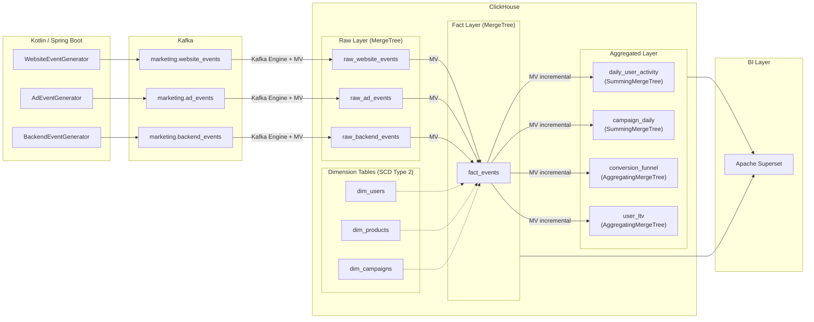
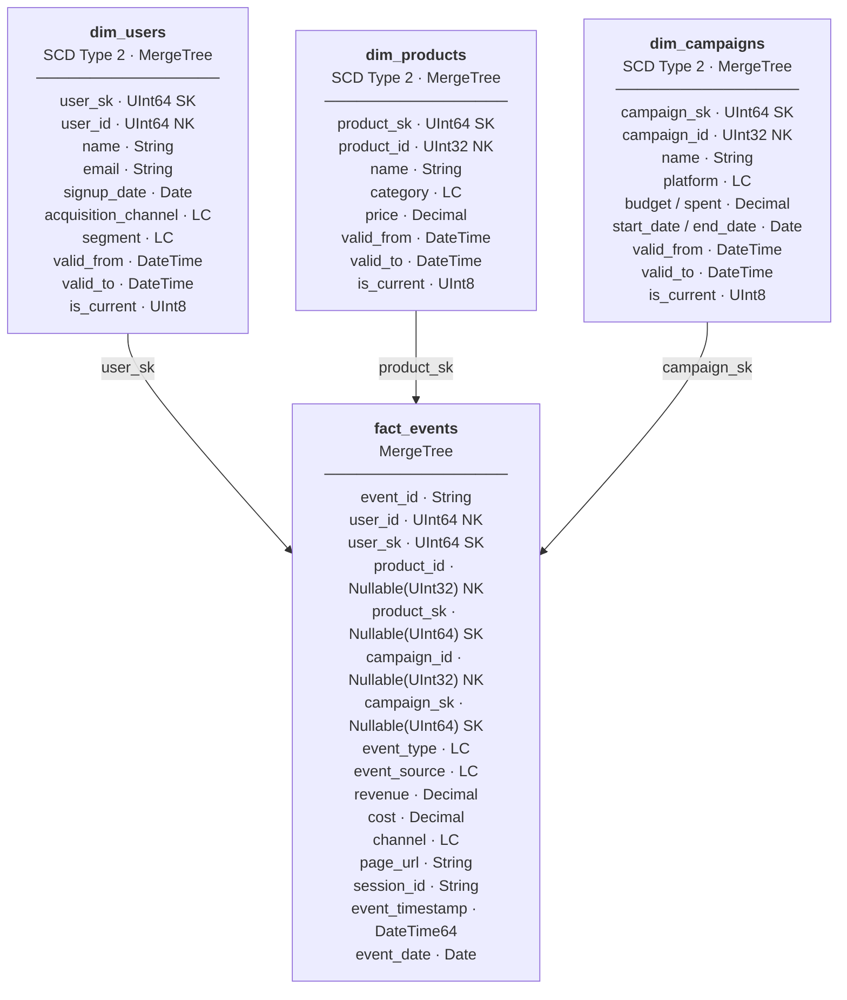
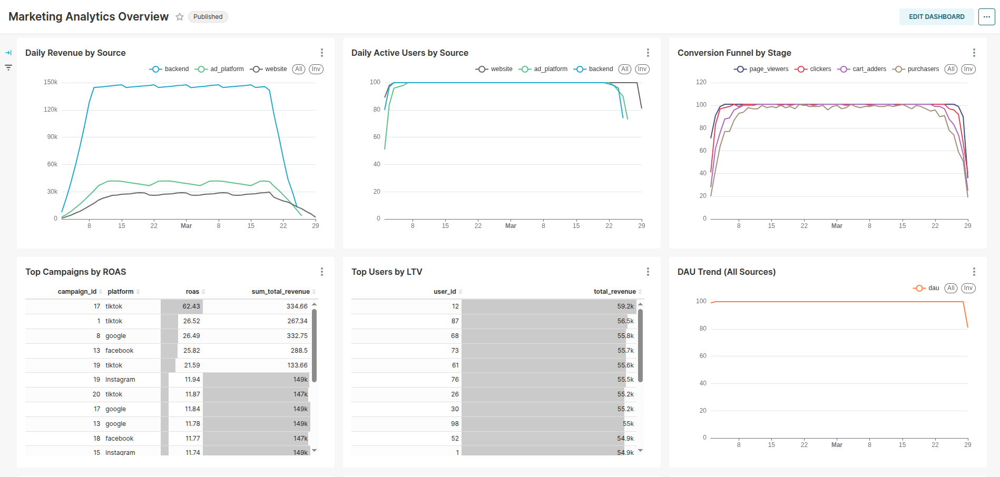
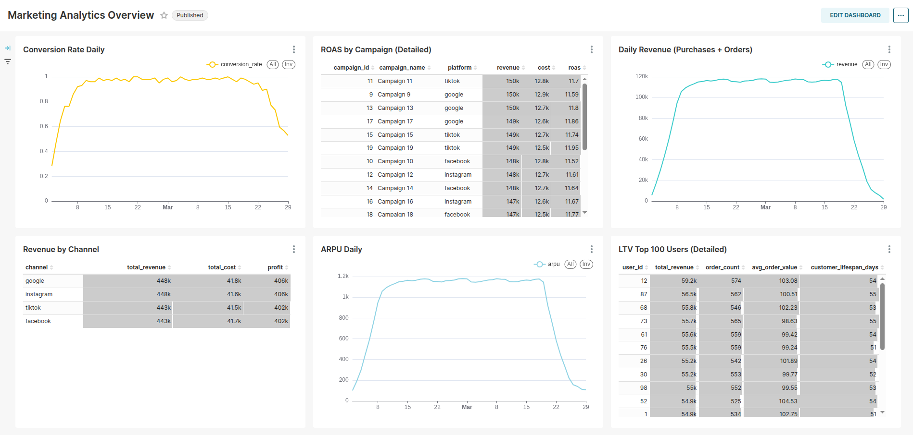

# Marketing Analytics Platform

**Схема:**



Data Warehouse на **ClickHouse** с real-time ingestion из **Kafka**, генерацией событий на **Kotlin / Spring Boot** и BI-дашбордами в **Apache Superset**.

Демонстрирует star schema dimension modeling, инкрементальную агрегацию через Materialized Views и выбор движков ClickHouse (MergeTree, ReplacingMergeTree, SummingMergeTree, AggregatingMergeTree).

**Ключевые возможности:**
- ✅ Многослойная DWH-архитектура: Raw → Dimension → Fact → Aggregated
- ✅ Real-time ingestion из Kafka через Kafka Engine + Materialized Views
- ✅ Star schema с SCD Type 2 dimension tables на MergeTree с surrogate keys
- ✅ Инкрементальная агрегация (SummingMergeTree, AggregatingMergeTree)
- ✅ Маркетинговые метрики: DAU, MAU, Conversion Rate, CAC, ROAS, ARPU, LTV
- ✅ Оптимизация: Projections, Data Skipping Indexes, LowCardinality, TTL

---

## 🛠 Технологический стек

| Компонент | Технология | Описание |
|-----------|-----------|----------|
| **Аналитическая БД** | ClickHouse 23.8 | Columnar OLAP-хранилище |
| **Брокер сообщений** | Apache Kafka (Confluent 7.5) | Streaming platform для событий |
| **Event Producer** | Kotlin 1.9 + Spring Boot 3.1 | Генерация событий в Kafka |
| **BI / Дашборды** | Apache Superset 3.1 | Визуализация метрик |
| **Оркестрация** | Docker Compose | Управление сервисами |

---

## Star Schema



*SK = Surrogate Key, NK = Natural Key, FK = Foreign Key, LC = LowCardinality(String)*

---

## 🔧 Требования

- **Docker** 20.10+
- **Docker Compose** 2.0+
- **JDK 17+** (для сборки приложений)
- **Gradle** (опционально, встроенный wrapper)

---

## 🚀 Быстрый старт

1. Соберите event-producer JAR из корня монорепо:
```bash
./gradlew :marketing-analytics-platform:event-producer:bootJar
```

2. Запустите все сервисы:
```bash
cd marketing-analytics-platform
docker-compose up -d
```

3. Остановка сервисов:
```bash
# Остановка с сохранением данных
docker-compose stop

# Остановка с удалением контейнеров (данные сохраняются в volumes)
docker-compose down

# Полное удаление включая volumes (⚠️ удалит все данные)
docker-compose down -v
```

Backfill добавляет synthetic historical events за последние 45 дней в `raw_*` tables. Дальше существующие Materialized Views автоматически проталкивают данные в `fact_events` и aggregated layer.

---

## 🌐 URL сервисов

После успешного запуска сервисы доступны по следующим адресам:

| Сервис | URL | Credentials | Описание |
|--------|-----|-------------|----------|
| **Kafka UI** | http://localhost:8080 | - | Мониторинг Kafka топиков и сообщений |
| **ClickHouse HTTP** | http://localhost:8123 | admin / admin123 | HTTP-интерфейс ClickHouse |
| **ClickHouse TCP** | localhost:9000 | admin / admin123 | TCP-доступ к ClickHouse |
| **Superset** | http://localhost:8088 | admin / admin | BI-дашборды и визуализация |

---

## 📁 Структура проекта

```
marketing-analytics-platform/
├── docker-compose.yml
├── README.md
├── clickhouse/
│   ├── 01-raw-layer.sql           # Kafka Engine + MergeTree + ingestion MVs
│   ├── 02-dimension-tables.sql    # dim_users, dim_products, dim_campaigns + seed data
│   ├── 03-fact-tables.sql         # fact_events + unification MVs
│   ├── 04-aggregated-tables.sql   # SummingMergeTree + AggregatingMergeTree tables
│   ├── 05-materialized-views.sql  # Incremental aggregation MVs
│   ├── 05a-views-for-superset.sql  # Views: conversion_funnel_daily_merged, user_ltv_final (for BI)
│   ├── 06-projections-indexes.sql # Projections + data skipping indexes
│   ├── 07-marketing-metrics.sql   # Готовые аналитические запросы
│   ├── 08-backfill-website-history.sql
│   ├── 09-backfill-ad-history.sql
│   └── 10-backfill-backend-history.sql
├── event-producer/
│   ├── build.gradle.kts
│   ├── Dockerfile
│   └── src/main/kotlin/com/example/marketing/
│       ├── MarketingEventProducerApplication.kt
│       ├── config/KafkaProducerConfig.kt
│       ├── model/{WebsiteEvent,AdEvent,BackendEvent}.kt
│       ├── generator/{Website,Ad,Backend}EventGenerator.kt
│       └── producer/EventProducer.kt
└── superset/
    ├── Dockerfile
    ├── superset_config.py
    ├── superset_init.sh
    └── docker-entrypoint.sh
```

---

## 🏗️ Дизайн таблиц ClickHouse

### Обзор слоёв

| Слой | Таблицы | Engine | Назначение |
|------|---------|--------|-----------|
| Raw | raw_website_events, raw_ad_events, raw_backend_events | MergeTree | Неизменяемый лог событий из Kafka |
| Dimension | dim_users, dim_products, dim_campaigns | MergeTree (SCD Type 2) | Surrogate key + valid_from/valid_to + is_current, полная история изменений |
| Fact | fact_events | MergeTree | Единое хранилище событий из всех источников; хранит и natural keys, и surrogate keys для джойна с dimension |
| Aggregated | daily_user_activity, campaign_performance_daily | SummingMergeTree | Аддитивные предагрегации (counts, sums) |
| Aggregated | conversion_funnel_daily, user_ltv | AggregatingMergeTree | Неаддитивные агрегации (HyperLogLog, min/max) |

### Выбор Engine

**MergeTree** — движок по умолчанию для raw и fact таблиц. Хранит каждую строку как есть. Поддерживает partitioning, primary key indexing, TTL, projections и data skipping indexes.

**MergeTree (SCD Type 2 Dimensions)** — для dimension tables с полной историей изменений. Каждая версия записи имеет surrogate key, `valid_from` / `valid_to` и флаг `is_current`. Materialized View при загрузке из raw‑слоя выполняет point-in-time JOIN по `natural_key + valid_from/valid_to`, разрешает surrogate key и записывает в fact одновременно natural key и surrogate key. Дальнейшие аналитические запросы (CAC, ROAS и др.) джойнятся от fact к dimension в основном по surrogate key, а исторические выборки по самой dimension — по `natural_key + valid_from/valid_to` или `is_current = 1`.

**SummingMergeTree((col1, col2, ...))** — для аддитивных предагрегаций (counts, sums, totals). При background merge строки с одинаковым ORDER BY ключом схлопываются: указанные числовые колонки суммируются. Идеально для `events_count`, `total_revenue`, `impressions`, `clicks`.

**AggregatingMergeTree** — для неаддитивных агрегаций. Хранит промежуточные состояния агрегатных функций (`AggregateFunction(uniq, UInt64)`), которые корректно мержатся при background merges. Необходим для:
- `uniq` / `uniqExact` (HyperLogLog оценка кардинальности)
- `quantile` (расчёт перцентилей)
- Любые агрегации, которые нельзя выразить через простое сложение

`SimpleAggregateFunction(sum, T)` — облегчённая альтернатива для простых агрегаций (sum, min, max, any) внутри AggregatingMergeTree.

---

## ⚙️ Внутреннее устройство ClickHouse

### Parts и Granules

Данные в ClickHouse организованы в **parts** — неизменяемые отсортированные блоки строк. Каждый INSERT создаёт новый part. Parts разделены на **granules** (по умолчанию 8192 строк).

**Sparse primary index** хранит одну запись на granule (значения ключа первой строки). Для 1 миллиарда строк индекс содержит всего ~122K записей и полностью помещается в памяти (~1-2 МБ).

```
Part (отсортирован по ORDER BY)
├── Granule 0: строки 0..8191      ← index entry: (event_source='ad_platform', event_type='click', user_id=1)
├── Granule 1: строки 8192..16383  ← index entry: (event_source='ad_platform', event_type='click', user_id=500)
├── Granule 2: строки 16384..24575 ← index entry: (event_source='website', event_type='page_view', user_id=1)
└── ...
```

### Background Merges

ClickHouse мержит parts в фоне, уменьшая их количество и улучшая производительность запросов. Поведение при merge зависит от движка:

- **MergeTree**: объединяет и сортирует, ничего не удаляет (сохраняет все строки)
- **ReplacingMergeTree**: оставляет только последнюю версию по ключу
- **SummingMergeTree**: суммирует числовые колонки для совпадающих ключей
- **AggregatingMergeTree**: мержит состояния агрегатных функций

Запросы могут читать незамерженные parts. Модификатор `FINAL` гарантирует точный результат (ценой однопоточного merge при чтении).

### Partitioning

`PARTITION BY toYYYYMM(event_date)` разбивает данные на месячные партиции. Преимущества:
- **Partition pruning**: запросы с фильтром по дате пропускают целые партиции
- **Удобное обслуживание**: `ALTER TABLE DROP PARTITION '202501'` мгновенно удаляет месяц данных
- **TTL**: `TTL event_date + INTERVAL 6 MONTH` автоматически удаляет устаревшие данные при merge

### Data Skipping Indexes

Вторичные индексы в ClickHouse работают на уровне блоков granules (не строк). Хранят сводную информацию и пропускают блоки, которые не могут содержать искомое значение.

| Тип индекса | Колонка | Как работает |
|-------------|---------|-------------|
| `minmax` | event_date | Хранит min/max по блоку. Пропускает, если диапазон запроса не пересекается. |
| `set(100)` | campaign_id | Хранит до 100 уникальных значений на блок. Пропускает, если значение отсутствует. |
| `bloom_filter(0.01)` | user_id | Вероятностный фильтр. 1% false positive. Идеален для high-cardinality колонок. |

### LowCardinality

Dictionary-encoded строковые колонки. Вместо хранения полной строки в каждой строке, ClickHouse хранит словарь уникальных значений и ссылки через integer ID. Оптимально для колонок с < ~10K уникальных значений.

Используется в проекте для: `event_type`, `event_source`, `platform`, `channel`, `acquisition_channel`, `segment`, `category`.

Влияние на производительность: 2-5x ускорение фильтрации, 3-10x меньше памяти по сравнению с обычным String.

### Projections

Альтернативные физические представления тех же данных, хранящиеся рядом с основными данными. ClickHouse автоматически выбирает лучшую projection для каждого запроса.

В проекте определены две projection на `fact_events`:
- `proj_by_campaign`: предагрегация по (campaign_id, event_date, event_type)
- `proj_by_user_date`: предагрегация по (user_id, event_date, event_type)

---

## 🔄 Kafka Ingestion Pattern

```
Kafka Topic ──► Kafka Engine Table ──► Materialized View ──► MergeTree Table
  (источник)     (виртуальный consumer)  (авто-триггер)       (хранилище)
```

Kafka Engine table выступает в роли consumer. Она **не доступна для прямых запросов** — строки исчезают после прочтения. Materialized View автоматически читает каждый batch и вставляет в целевую MergeTree таблицу.

Так как event producer отправляет `timestamp` из Kotlin `Instant` как Unix timestamp с дробной частью, в `kafka_*` таблицах это поле принимается как `Float64`, а затем в MV приводится к `DateTime64(3)` через `fromUnixTimestamp64Milli(toInt64(timestamp * 1000))` перед записью в `raw_*`.

Этот паттерн обеспечивает exactly-once семантику внутри ClickHouse (offset коммитится после успешного INSERT в целевую таблицу).

---

## 🔗 Materialized Views и инкрементальная агрегация

Materialized Views в ClickHouse — это **INSERT triggers**, а не кэшированные результаты запросов. При вставке данных в таблицу-источник MV:

1. Читает только новый блок строк
2. Применяет SELECT-трансформацию / агрегацию
3. Вставляет результат в целевую таблицу

В сочетании с SummingMergeTree / AggregatingMergeTree это создаёт **инкрементальный aggregation pipeline** со стоимостью O(new_data) на batch.

```
fact_events (INSERT 1000 строк)
  ├──► mv_daily_user_activity      → daily_user_activity (SummingMergeTree)
  ├──► mv_conversion_funnel        → conversion_funnel_daily (AggregatingMergeTree)
  ├──► mv_campaign_performance     → campaign_performance_daily (SummingMergeTree)
  └──► mv_user_ltv                 → user_ltv (AggregatingMergeTree)
```

---

## 📊 Маркетинговые метрики

| Метрика | Определение | Таблица / Запрос |
|---------|------------|-----------------|
| **DAU** | Daily Active Users | `uniqExact(user_id)` из fact_events с фильтром по дате |
| **MAU** | Monthly Active Users | `uniqExact(user_id)` из fact_events, окно 30 дней |
| **Conversion Rate** | Покупатели / Просмотревшие | `uniqMerge(purchasers) / uniqMerge(page_viewers)` из conversion_funnel_daily |
| **CAC** | Customer Acquisition Cost | Общие затраты на рекламу / новые клиенты по платформе |
| **ROAS** | Return on Ad Spend | Доход кампании / затраты кампании из campaign_performance_daily |
| **Revenue** | Дневной доход | `sum(total_revenue)` из daily_user_activity |
| **ARPU** | Average Revenue Per User | Доход / платящие пользователи за день |
| **LTV** | Lifetime Value | Кумулятивный доход на пользователя из user_ltv |




Все запросы доступны в `clickhouse/07-marketing-metrics.sql`.

---

## 🎯 Event Producer

Три Kotlin / Spring Boot scheduled-генератора создают реалистичные события в Kafka:

| Генератор | Topic | Частота | Типы событий (взвешенное распределение) |
|-----------|-------|---------|----------------------------------------|
| WebsiteEventGenerator | marketing.website_events | 500ms | page_view(40%), click(25%), add_to_cart(15%), purchase(10%), signup(10%) |
| AdEventGenerator | marketing.ad_events | 1s | impression(60%), click(25%), conversion(15%) |
| BackendEventGenerator | marketing.backend_events | 2s | registration(15%), order_completed(50%), payment_received(35%) |

Взвешенные распределения создают реалистичные drop-off воронки для осмысленного анализа конверсии.

---

## 📈 Superset Dashboards

После запуска Superset автоматически подключается к ClickHouse и bootstrap-скрипт создаёт базовые `dataset` и `chart` для демонстрации пайплайна. Рекомендуемые панели для дашборда:

| Панель | Тип графика | Метрика |
|--------|------------|---------|
| DAU / MAU Overview | Big Number | DAU, MAU, Revenue Today, Conversion Rate |
| DAU Trend | Line Chart | Активные пользователи за 90 дней |
| Revenue by Channel | Stacked Bar | Доход по рекламным платформам |
| Campaign Performance | Table | ROAS, CAC, CTR по кампании |
| Conversion Funnel | Funnel Chart | View → Click → Cart → Purchase |
| User LTV Distribution | Histogram | Распределение дохода по пользователям |
| Top Campaigns by ROAS | Horizontal Bar | Лучшие кампании по ROAS |

---

## ✅ Чеклист оптимизации

- [x] Partitioning по `toYYYYMM(event_date)` на всех таблицах с датами
- [x] LowCardinality на всех low-cardinality строковых колонках
- [x] Decimal(18,2) для денежных значений (без ошибок округления float)
- [x] TTL на raw таблицах (хранение 6 месяцев)
- [x] Data Skipping Indexes (minmax, set, bloom_filter)
- [x] Projections для частых паттернов запросов
- [x] Раздельные PRIMARY KEY и ORDER BY для компактного sparse index
- [x] SCD Type 2 для dimension tables (surrogate key + valid_from/valid_to + is_current)
- [x] SummingMergeTree для аддитивных агрегаций
- [x] AggregatingMergeTree с uniqState/uniqMerge для точной кардинальности
- [x] Materialized Views для инкрементальной агрегации (стоимость O(new_data))
