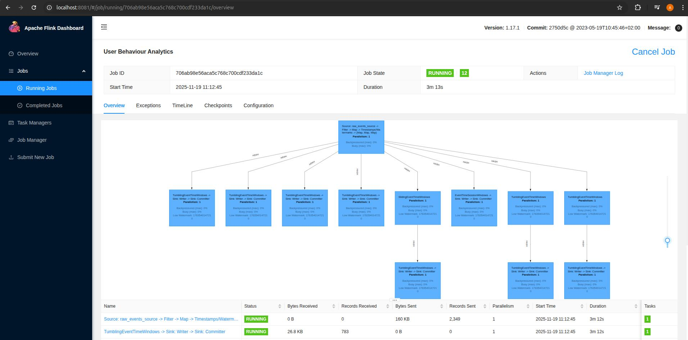

# ⚡ Flink User Behaviour Analytics Pipeline

**Схема:**  
User Behaviour Emulator → Gateway WebSocket → Kafka → Flink (stream processing) → Kafka → ClickHouse → Grafana (BI 
dashboards)

Комплексный пайплайн для потоковой обработки пользовательских событий с визуализацией метрик в реальном времени.

---

## 🛠 Технологический стек

- **Apache Kafka** — брокер сообщений для событий
- **Apache Flink** — потоковая обработка данных
- **ClickHouse** — аналитическая база данных для хранения метрик
- **Grafana** — BI‑дашборды и визуализация
- **Zookeeper** — координация Kafka брокеров
- **Kafka UI (Redpanda Console)** — удобный интерфейс для мониторинга топиков
- **Gateway WebSocket** — шлюз для приёма событий от эмулятора
- **User Behaviour Emulator** — генератор пользовательских событий

---

## 🔧 Требования

- **Docker** 20.10+
- **Docker Compose** 2.0+
- **JDK 17+** (для сборки Flink‑приложений)
- **Gradle/Maven** (опционально, встроенный wrapper)

---

## 🚀 Быстрый старт

1. Клонируйте репозиторий и соберите Flink‑приложение:
```bash
git clone <repository-url>
cd flink-pipeline
./gradlew clean build
```

2. Запустите все сервисы:
```bash
docker-compose up -d
```
3. Остановка сервисов:
```bash
# Остановка с сохранением данных
docker-compose stop

# Остановка с удалением контейнеров (данные сохраняются в volumes)
docker-compose down

# Полное удаление включая volumes (удалит все данные)
docker-compose down -v
```

## 🌐 URL сервисов

После успешного запуска, сервисы доступны по следующим адресам:

| Сервис                | URL                          | Credentials       | Описание                          |
|-----------------------|------------------------------|------------------|-----------------------------------|
| **Kafka UI**          | http://localhost:8088        | -                | Мониторинг Kafka topics           |
| **Flink Dashboard**   | http://localhost:8081        | -                | Мониторинг Flink jobs             |
| **Grafana**           | http://localhost:3000        | admin / admin    | BI‑дашборды                       |
| **ClickHouse HTTP**   | http://localhost:8123        | admin / admin123 | Хранилище аналитических данных    |
| **ClickHouse TCP**    | localhost:9000               | admin / admin123 | TCP‑доступ к ClickHouse           |
| **Gateway WebSocket** | ws://localhost:8080/ws/events| -                | Приём событий от эмулятора        |

Flink job

---

## 📊 Grafana Dashboard

Метрики:
- **Events per Type** — распределение событий
- **Page Views** — активность по страницам
- **Unique Users per Page** — уникальные пользователи
- **Conversion Rate** — конверсия (view → purchase)
- **Session Stats** — длительность и количество событий в сессии
- **Funnel Stats** — воронка (view → click → purchase)
- **Activity Heatmap** — активность по часам суток
- **Retention** — возвращающиеся vs новые пользователи
  
---

## 🏗️ Особенности реализации

- **User Behaviour Emulator** симулирует поведение пользователя на фронте и отправляет события через WebSocket
- **Gateway WebSocket** - шлюз бэкэнда, принимает события из весокета и публикует их в Kafka
- **Apache Flink** агрегирует события и сохраняет результаты в Kafka
- **Grafana** подключается к ClickHouse и визуализирует метрики
- **Docker Compose** управляет запуском всех сервисов